# Pipeline Scope

This notebook encompasses checks for missing and zero values,
exploratory data analysis, feature engineering and creation of a
stratified sample to address a few dominant sectors in the source data.

# Load Libraries

I leverage the following R packages: `dplyr`, `lubridate`, `stringr` and
`tidyr` for data manipulation, `knitr` for table formatting, and
`ggplot2` and `ggridges` for visualization.

# Load Data

Load the Form 5500 data.

``` r
plans <- readRDS("../data/plans_original.rds")
```

This analysis focuses on 401(k) plans because they are the dominant
defined contribution vehicle in the U.S. private sector, offering broad
sector coverage and stable representation in Form 5500 data. While I
initially considered 403(b) plans, their sparse and sector-specific
presence, primarily in nonprofits and education, limits their utility
for benchmarking and fairness diagnostics.

The baseline dataset includes 5,579 plans and 21 variables.

# Missing Data

Generate a table to check for missing values at the column and row
level.

``` r
# Create column level summary.

col_missing <- plans %>%
  summarise(across(everything(), ~ sum(is.na(.)))) %>%
  pivot_longer(cols = everything(),
               names_to = "Variable",
               values_to = "Missing_Count") %>%
  mutate(Missing_Percent = Missing_Count / nrow(plans) * 100)

# Create row level summary.

row_missing <- tibble(Variable = "Rows Any Missing",
                      Missing_Count = sum(!complete.cases(plans)),
                      Missing_Percent = sum(!complete.cases(plans)) / nrow(plans) * 100)

# Combine summaries.

missing_report <- bind_rows(col_missing, row_missing)

kable(missing_report,
      col.names = c("Variable", "Missing Count", "Missing Percent"),
      caption = "Missing Data",
      format.args = list(big.mark = ","),
      align = c("l", "r", "r"))
```

| Variable                 | Missing Count | Missing Percent |
|:-------------------------|--------------:|----------------:|
| ACK_ID                   |             0 |               0 |
| PLAN_YEAR_BEGIN_DATE     |             0 |               0 |
| PLAN_YEAR_END_DATE       |             0 |               0 |
| PLAN_NAME                |             0 |               0 |
| PLAN_EFFECTIVE_DATE      |             0 |               0 |
| PLAN_TYPE                |             0 |               0 |
| SPONSOR_NAME             |             0 |               0 |
| SPONSOR_STATE            |             0 |               0 |
| SPONSOR_EIN              |             0 |               0 |
| BUSINESS_CODE            |             0 |               0 |
| TOTAL_ACCBAL_PARTCP_BOY  |             0 |               0 |
| TOTAL_ACCBAL_PARTCP_EOY  |             0 |               0 |
| TOTAL_CONTRIB_PARTCP_BOY |             0 |               0 |
| TOTAL_CONTRIB_PARTCP_EOY |             0 |               0 |
| TOTAL_CONTRIB_EMPLR_BOY  |             0 |               0 |
| TOTAL_CONTRIB_EMPLR_EOY  |             0 |               0 |
| TOTAL_LOANS_BOY          |             0 |               0 |
| TOTAL_LOANS_EOY          |             0 |               0 |
| TOTAL_ASSETS_BOY         |             0 |               0 |
| TOTAL_ASSETS_EOY         |             0 |               0 |
| INDUSTRY_TITLE           |             0 |               0 |
| Rows Any Missing         |             0 |               0 |

Missing Data

There are no missing values in the dataset; verify if count and amount
variables take on zero values, as these may indicate inactive plans,
reporting artifacts, or edge cases requiring further review.

# Zero Values

Generate a report to check or zero values at the column and row level.

``` r
# Create column level summary.

col_zero <- plans %>%
  summarise(across(everything(), ~ sum(. == 0, na.rm = TRUE))) %>%
  pivot_longer(cols = everything(),
               names_to = "Variable",
               values_to = "Zero_Count") %>%
  mutate(Zero_Percent = Zero_Count / nrow(plans) * 100)

# Create row level summary.

row_zero <- tibble(Variable = "Rows Any Zero",
                   Zero_Count = sum(apply(plans == 0, 1, any, na.rm = TRUE)),
                   Zero_Percent = sum(apply(plans == 0, 1, any, na.rm = TRUE)) / nrow(plans) * 100)

# Combine summaries.

zero_report <- bind_rows(col_zero, row_zero)

kable(zero_report,
      col.names = c("Variable", "Zero Count", "Zero Percent"),
      caption = "Zero Value Summary",
      format.args = list(big.mark = ","),
      align = c("l", "r", "r"))
```

| Variable                 | Zero Count | Zero Percent |
|:-------------------------|-----------:|-------------:|
| ACK_ID                   |          0 |            0 |
| PLAN_YEAR_BEGIN_DATE     |          0 |            0 |
| PLAN_YEAR_END_DATE       |          0 |            0 |
| PLAN_NAME                |          0 |            0 |
| PLAN_EFFECTIVE_DATE      |          0 |            0 |
| PLAN_TYPE                |          0 |            0 |
| SPONSOR_NAME             |          0 |            0 |
| SPONSOR_STATE            |          0 |            0 |
| SPONSOR_EIN              |          0 |            0 |
| BUSINESS_CODE            |          0 |            0 |
| TOTAL_ACCBAL_PARTCP_BOY  |          0 |            0 |
| TOTAL_ACCBAL_PARTCP_EOY  |          0 |            0 |
| TOTAL_CONTRIB_PARTCP_BOY |          0 |            0 |
| TOTAL_CONTRIB_PARTCP_EOY |          0 |            0 |
| TOTAL_CONTRIB_EMPLR_BOY  |          0 |            0 |
| TOTAL_CONTRIB_EMPLR_EOY  |          0 |            0 |
| TOTAL_LOANS_BOY          |          0 |            0 |
| TOTAL_LOANS_EOY          |          0 |            0 |
| TOTAL_ASSETS_BOY         |          0 |            0 |
| TOTAL_ASSETS_EOY         |          0 |            0 |
| INDUSTRY_TITLE           |          0 |            0 |
| Rows Any Zero            |          0 |            0 |

Zero Value Summary

The dataset does not include any zero values.

# Exploratory Data Analysis

## Acknowledgement Id

**ACK_ID**

Acknowledgement Id is a unique identifier assigned by the Department of
Labor (DOL) or IRS when a Form 5500 filing is successfully received and
acknowledged. Think of it as a receipt number; it confirms that the
filing was accepted into the system. It’s used for tracking, auditing,
or linking filings across systems.

## Plan Year Begin/End Dates

**PLAN_YEAR_BEGIN_DATE, PLAN_YEAR_END_DATE**

These dates define the reporting window for all financial and
participant metrics. The dataset contains filings with a plan year begin
date of January 1, 2023 and end date of December 31, 2023.

## Plan Effective Date

**PLAN_EFFECTIVE_DATE**

Plan effective date marks the official inception of a retirement plan;
it anchors a plan’s life cycle.

From an analytic perspective, plan effective date enables several
valuable transformations. Calculating plan age from this field allows
for stratification by maturity, which is useful when assessing financial
readiness across vintage cohorts. Plans initiated in different eras may
reflect distinct design philosophies, contribution behaviors, or
participant engagement patterns.

Generate a summary count of plans by plan effective year.

``` r
summary_by_plan_effective_year <- plans %>%
  mutate(PLAN_EFFECTIVE_YEAR = as.character(year(PLAN_EFFECTIVE_DATE))) %>%
  group_by(PLAN_EFFECTIVE_YEAR) %>%
  arrange(PLAN_EFFECTIVE_YEAR) %>%
  summarise(entries = n()) %>%
  mutate(percent = round(entries / sum(entries), 2))

kable(summary_by_plan_effective_year,
      col.names = c("Year", "Plans", "Percent"),
      caption = "Summary By Plan Effective Year",
      format.args = list(big.mark = ","),
      align = c("l", "r", "r"))
```

| Year | Plans | Percent |
|:-----|------:|--------:|
| 1945 |     3 |    0.00 |
| 1948 |     1 |    0.00 |
| 1949 |     1 |    0.00 |
| 1950 |     3 |    0.00 |
| 1952 |     4 |    0.00 |
| 1953 |     6 |    0.00 |
| 1954 |     2 |    0.00 |
| 1955 |     3 |    0.00 |
| 1956 |     6 |    0.00 |
| 1957 |     5 |    0.00 |
| 1958 |     8 |    0.00 |
| 1959 |     7 |    0.00 |
| 1960 |    11 |    0.00 |
| 1961 |     6 |    0.00 |
| 1962 |     5 |    0.00 |
| 1963 |     9 |    0.00 |
| 1964 |     9 |    0.00 |
| 1965 |     7 |    0.00 |
| 1966 |     9 |    0.00 |
| 1967 |    14 |    0.00 |
| 1968 |    23 |    0.00 |
| 1969 |    25 |    0.00 |
| 1970 |    21 |    0.00 |
| 1971 |    19 |    0.00 |
| 1972 |    17 |    0.00 |
| 1973 |    30 |    0.01 |
| 1974 |    29 |    0.01 |
| 1975 |    28 |    0.01 |
| 1976 |    32 |    0.01 |
| 1977 |    24 |    0.00 |
| 1978 |    30 |    0.01 |
| 1979 |    35 |    0.01 |
| 1980 |    36 |    0.01 |
| 1981 |    38 |    0.01 |
| 1982 |    41 |    0.01 |
| 1983 |    62 |    0.01 |
| 1984 |   115 |    0.02 |
| 1985 |   140 |    0.03 |
| 1986 |   114 |    0.02 |
| 1987 |   135 |    0.02 |
| 1988 |   100 |    0.02 |
| 1989 |   138 |    0.02 |
| 1990 |   144 |    0.03 |
| 1991 |   129 |    0.02 |
| 1992 |   138 |    0.02 |
| 1993 |   172 |    0.03 |
| 1994 |   182 |    0.03 |
| 1995 |   163 |    0.03 |
| 1996 |   186 |    0.03 |
| 1997 |   213 |    0.04 |
| 1998 |   176 |    0.03 |
| 1999 |   149 |    0.03 |
| 2000 |   153 |    0.03 |
| 2001 |   110 |    0.02 |
| 2002 |   118 |    0.02 |
| 2003 |   105 |    0.02 |
| 2004 |   122 |    0.02 |
| 2005 |   128 |    0.02 |
| 2006 |   150 |    0.03 |
| 2007 |   133 |    0.02 |
| 2008 |   114 |    0.02 |
| 2009 |    98 |    0.02 |
| 2010 |    72 |    0.01 |
| 2011 |   104 |    0.02 |
| 2012 |    94 |    0.02 |
| 2013 |   107 |    0.02 |
| 2014 |   121 |    0.02 |
| 2015 |   124 |    0.02 |
| 2016 |   144 |    0.03 |
| 2017 |   132 |    0.02 |
| 2018 |   108 |    0.02 |
| 2019 |   114 |    0.02 |
| 2020 |    76 |    0.01 |
| 2021 |    84 |    0.02 |
| 2022 |    65 |    0.01 |

Summary By Plan Effective Year

Plan formation is historically sparse, with most years before 1975
contributing fewer than 10 plans, and often just one or two. A modest
uptick begins in the mid-1970s, reflecting regulatory shifts and greater
employer adoption of defined contribution plans.

Plot plans by plan effective year.

``` r
ggplot(summary_by_plan_effective_year, aes(x = as.integer(PLAN_EFFECTIVE_YEAR), y = entries)) +
  geom_col(fill = "steelblue", color = "white") +
  labs(title = "Distribution of Plans by Plan Effective Year",
       x = "Year",
       y = "Plans") +
  theme_minimal() +
  theme(axis.text.x = element_text(angle = 0, hjust = 0.5),
        plot.title = element_text(size = 14, face = "bold"))
```

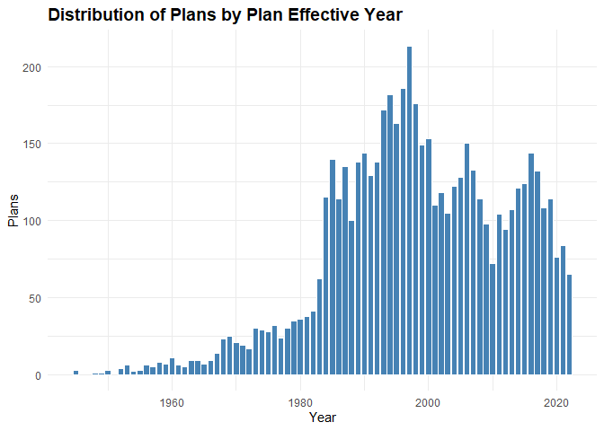<!-- -->

The gradual rise from the 1940s through the 1970s reflects the early
institutionalization of employer-sponsored plans, driven by post-war
economic expansion and the formalization of pension structures.

The uptick in the late 1970s through the 1990s coincides with major
policy shifts, most notably the passage of ERISA in 1974 and the rise of
defined contribution plans like 401(k) plans in the early 1980s. This
era marks a surge in plan formation, especially among small and
mid-sized employers responding to new tax incentives.

The peak in the late 1990s to early 2000s suggests a saturation point,
after which the decline reflects consolidation of plans, sponsor exits,
a shift toward pooled and multi-employer arrangements, and market
volatility post-2008 influencing plan formation.

Grouping plans into vintages, i.e. multi-year cohorts based on effective
year, helps mitigate the annual sparsity in the early years of the data.

## Plan Vintage Group

**PLAN_VINTAGE_GROUP**

Engineer a plan vintage group variable.

``` r
plans <- plans %>%
  mutate(PLAN_EFFECTIVE_YEAR = year(PLAN_EFFECTIVE_DATE),
    PLAN_VINTAGE_GROUP = case_when(
      is.na(PLAN_EFFECTIVE_YEAR) ~ NA_character_,
      PLAN_EFFECTIVE_YEAR < 1990 ~ "Legacy",
      PLAN_EFFECTIVE_YEAR >= 1990 & PLAN_EFFECTIVE_YEAR <= 1999 ~ "Expansion", 
      PLAN_EFFECTIVE_YEAR >= 2000 & PLAN_EFFECTIVE_YEAR <= 2010 ~ "Modern",
      PLAN_EFFECTIVE_YEAR > 2010 ~ "Recent"),
    PLAN_VINTAGE_GROUP = factor(PLAN_VINTAGE_GROUP,
      levels = c("Legacy", "Expansion", "Modern", "Recent"),
      ordered = TRUE))
```

Plot plans by plan vintage group.

``` r
summary_by_plan_vintage_group <- plans %>%
  group_by(PLAN_VINTAGE_GROUP) %>%
  summarise(entries = n()) %>%
  mutate(percent = round(entries / sum(entries), 2))

ggplot(summary_by_plan_vintage_group, aes(x = PLAN_VINTAGE_GROUP, y = entries)) +
  geom_col(fill = "steelblue", color = "white") +
  geom_text(aes(label = paste0(scales::comma(entries), "\n", round(percent * 100, 0), "%")),
            vjust = -0.3, size = 3.0) +
  labs(title = "Distribution of Plans By Plan Vintage Group",
       x = "Period",
       y = "Group") +
  theme_minimal() +
  theme(axis.text.x = element_text(angle = 0, hjust = 0.5),
        plot.title = element_text(size = 14, face = "bold")) +
  expand_limits(y = max(summary_by_plan_vintage_group$entries) * 1.2)
```

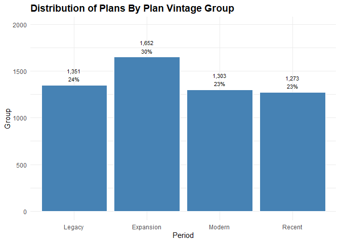<!-- -->

During the Expansion period, retirement plans surged. Legacy plans still
hold strong at 24%. Modern and Recent vintages trail closely behind at
23% each, suggesting a stabilization in newer plan adoption. The
distribution reflects pivotal growth phase during Expansion, followed by
a leveling off in more recent years.

## Business Code and Industry Title

**BUSINESS_CODE, INDUSTRY_TITLE**

Business code refers to the six-digit code used to classify the primary
business activity of the plan sponsor, based on the North American
Industry Classification System (NAICS). It identifies the economic
sector in which the sponsoring organization operates, such as
manufacturing, healthcare, finance, or education. Industry title is the
human-readable label associated with that code.

``` r
summary_by_industry_title <- plans %>%
  group_by(INDUSTRY_TITLE) %>%
  summarise(entries = n()) %>%
  arrange(desc(entries)) %>%
  mutate(percent = round(entries / sum(entries), 2))

kable(head(summary_by_industry_title, 20),
      col.names = c("Industry", "Plans", "Percent"),
      caption = "Summary By Industry Title - Top 20 Industries",
      format.args = list(big.mark = ","),
      align = c("l", "r", "r"))
```

| Industry                                                   | Plans | Percent |
|:-----------------------------------------------------------|------:|--------:|
| All other professional, scientific, and technical services |   190 |    0.03 |
| Offices of physicians (except mental health specialists)   |   186 |    0.03 |
| New car dealers                                            |   141 |    0.03 |
| Offices of lawyers                                         |   129 |    0.02 |
| Management, scientific, and technical consulting services  |   117 |    0.02 |
| Other miscellaneous manufacturing                          |   108 |    0.02 |
| Engineering services                                       |   101 |    0.02 |
| Other fabricated metal product manufacturing               |    91 |    0.02 |
| Offices of other holding companies                         |    86 |    0.02 |
| Other computer related services                            |    77 |    0.01 |
| Other specialty trade contractors                          |    77 |    0.01 |
| Educational services                                       |    76 |    0.01 |
| Nursing and residential care facilities                    |    75 |    0.01 |
| Commercial banking                                         |    67 |    0.01 |
| General freight trucking, long-distance                    |    66 |    0.01 |
| Hospitals                                                  |    66 |    0.01 |
| Plastics product manufacturing                             |    66 |    0.01 |
| Nonresidential building construction                       |    64 |    0.01 |
| Custom computer programming services                       |    60 |    0.01 |
| Motor vehicle parts manufacturing                          |    56 |    0.01 |

Summary By Industry Title - Top 20 Industries

Representation at the detailed industry title level is sparse. Most
individual NAICS-derived titles contribute less than 0.03% of total plan
filings. Modeling or benchmarking at this granularity may be noisy or
unstable. A few industries dominate plan filings, while most contribute
marginally. Using these titles directly in models could lead to poor
generalization unless grouped.

## Sector Code and Sector Title

**SECTOR_CODE, SECTOR_TITLE, SECTOR_TITLE_SHORT**

Collapse industry titles to broader categories using existing code
structure and group industries into sectors.

``` r
business_codes <- readRDS("../data/business_codes.rds")

business_codes <- business_codes %>%
  rename(SECTOR_CODE = BUSINESS_CODE,
         SECTOR_TITLE = INDUSTRY_TITLE) %>%
  mutate(SECTOR_TITLE_SHORT = stringr::str_trunc(SECTOR_TITLE, width = 15))

plans <- plans %>%
  mutate(SECTOR_CODE = as.integer(substr(BUSINESS_CODE, 1, 2)) * 10000)

plans <- left_join(plans, business_codes, by = "SECTOR_CODE")
```

Check counts for reference level, find the median category by count,
relevel and set the reference level.

``` r
sector_counts <- plans %>%
  count(SECTOR_TITLE_SHORT, name = "n") %>%
  arrange(n)

central_sector <- sector_counts$SECTOR_TITLE_SHORT[ceiling(nrow(sector_counts) / 2)]

# Information is the central sector in the group.

plans$SECTOR_TITLE_SHORT <- relevel(factor(plans$SECTOR_TITLE_SHORT), ref = "Information")
```

Summarize plans by sector.

``` r
summary_by_sector_title <- plans %>%
  group_by(SECTOR_TITLE_SHORT) %>%
  summarise(entries = n()) %>%
  arrange(desc(entries)) %>%
  mutate(percent = round(entries / sum(entries), 2))

kable(summary_by_sector_title,
      col.names = c("Sector Title", "Plans", "Percent"),
      caption = "Summary By Sector Title",
      format.args = list(big.mark = ","),
      align = c("l", "r", "r"))
```

| Sector Title    | Plans | Percent |
|:----------------|------:|--------:|
| Manufacturing   | 1,237 |    0.22 |
| Professional…   |   918 |    0.16 |
| Health care …   |   594 |    0.11 |
| Retail trade    |   365 |    0.07 |
| Construction    |   352 |    0.06 |
| Finance and …   |   339 |    0.06 |
| Wholesale trade |   329 |    0.06 |
| Transportati…   |   260 |    0.05 |
| Administrati…   |   187 |    0.03 |
| Other servic…   |   168 |    0.03 |
| Information     |   160 |    0.03 |
| Real estate …   |   149 |    0.03 |
| Accommodatio…   |   115 |    0.02 |
| Management o…   |    93 |    0.02 |
| Educational …   |    76 |    0.01 |
| Arts, entert…   |    73 |    0.01 |
| Utilities       |    61 |    0.01 |
| Mining, quar…   |    47 |    0.01 |
| Agriculture,…   |    46 |    0.01 |
| Public admin…   |    10 |    0.00 |

Summary By Sector Title

Sector grouping reveals strong concentration and long-tail sparsity.
Just three sectors, Manufacturing, Professional Services, and Health
Care, account for nearly half of all plans, while the bottom dozen
sectors each contribute less than 3%. This uneven distribution suggests
structural disparities in retirement plan availability, with some
sectors historically under-served or slower to adopt.

Plot by sector title.

``` r
ggplot(summary_by_sector_title, aes(x = forcats::fct_reorder(SECTOR_TITLE_SHORT, 
                                                             entries, .desc = TRUE), y = entries)) +
  geom_col(fill = "steelblue", color = "white") +
  geom_text(aes(label = paste0(scales::comma(entries), "\n", round(percent * 100, 0), "%")),
            vjust = -0.3, size = 3.0) +
  labs(title = "Distribution of Plans By Sector",
       x = "Sector",
       y = "Plans") +
  theme_minimal() +
  theme(axis.text.x = element_text(angle = 90, hjust = 0.5),
        plot.title = element_text(size = 14, face = "bold")) +
  expand_limits(y = max(summary_by_sector_title$entries) * 1.2)
```

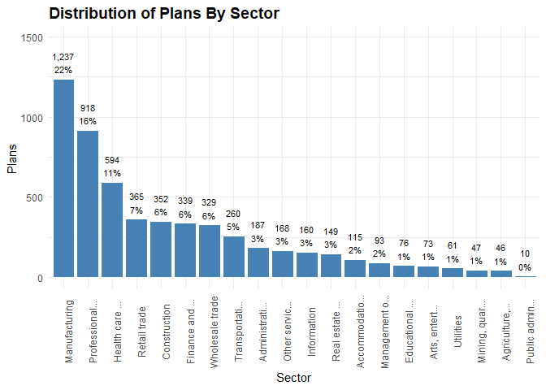<!-- -->

Given the high concentration in a few dominant sectors and the long tail
of underrepresented sectors, a stratified sample will ensure equitable
representation across sectors and improve diagnostic clarity when
benchmarking plan adequacy.

## Create Stratified Sample

Create a stratified sample with plan vintage and sector strata. Set a
sector cap to ensure balanced representation.

``` r
# Count plans by vintage-sector strata.

strata_counts <- plans %>%
  count(PLAN_VINTAGE_GROUP, SECTOR_TITLE_SHORT)

# Define initial sample size per stratum (proportional with minimum floor).

strata_counts <- strata_counts %>%
  mutate(sample_n = pmax(round(n / sum(n) * 5000), 5))

# Compute total sample size per sector across vintages.

sector_totals <- strata_counts %>%
  group_by(SECTOR_TITLE_SHORT) %>%
  summarise(sector_sample_total = sum(sample_n), .groups = "drop")

# Set sector-level cap and compute scale factor.

sector_cap <- 100

sector_totals <- sector_totals %>%
  mutate(scale_factor = pmin(1, sector_cap / sector_sample_total))

# Apply scale factor to each stratum's sample size.

strata_counts <- strata_counts %>%
  left_join(sector_totals, by = "SECTOR_TITLE_SHORT") %>%
  mutate(sample_n_capped = pmax(round(sample_n * scale_factor), 5))

# Join capped sample sizes to full plan data.

plans_joined <- plans %>%
  inner_join(strata_counts %>%
             select(PLAN_VINTAGE_GROUP, SECTOR_TITLE_SHORT, sample_n_capped),
             by = c("PLAN_VINTAGE_GROUP", "SECTOR_TITLE_SHORT")) %>%
  rename(sample_n = sample_n_capped)

# Split into strata and sample per stratum.

plans_split <- plans_joined %>%
  group_split(PLAN_VINTAGE_GROUP, SECTOR_TITLE_SHORT)

plans_stratified <- purrr::map_dfr(plans_split, ~ slice_sample(.x, n = .x$sample_n[1]))
```

Check representation in the sample compared to the original
distribution.

``` r
full_dist <- plans %>%
  count(PLAN_VINTAGE_GROUP, SECTOR_TITLE_SHORT, name = "full_n")

sample_dist <- plans_stratified %>%
  count(PLAN_VINTAGE_GROUP, SECTOR_TITLE_SHORT, name = "sample_n")

representation_check <- full_dist %>%
  full_join(sample_dist, by = c("PLAN_VINTAGE_GROUP", "SECTOR_TITLE_SHORT")) %>%
  mutate(full_n = replace_na(full_n, 0),
         sample_n = replace_na(sample_n, 0),
         sample_share = sample_n / sum(sample_n),
         full_share = full_n / sum(full_n),
         ratio = sample_share / full_share) %>% arrange(desc(ratio))
```

This representation check provides a ratio that shows how well each
sector-vintage stratum is represented in the stratified sample relative
to its full share.

Plot the ratios.

``` r
ggplot(representation_check, aes(x = reorder(SECTOR_TITLE_SHORT, ratio), 
                                 y = ratio, 
                                 fill = PLAN_VINTAGE_GROUP)) +
  geom_col(position = "dodge") +
  geom_hline(yintercept = 1, 
             linetype = "dashed", 
             color = "gray40") +
  scale_fill_manual(values = c("Legacy" = "#4682B4",
                               "Expansion" = "#5A9BD4",
                               "Modern" = "#7FB3D5",
                               "Recent" = "#A9CCE3")) +
  labs(title = "Stratified Sample Representation by Sector and Vintage",
       x = "Sector",
       y = "Sample Share / Full Share (Ratio)",
       fill = "Vintage Group") +
  coord_flip() +
  theme_minimal() +
  theme(axis.text.x = element_text(angle = 0, hjust = 0.5),
        plot.title = element_text(size = 14, face = "bold"))
```

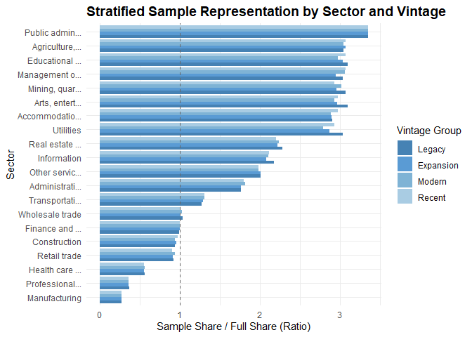<!-- -->

This plot confirms that the stratified sample reduces
over-representation from dominant sectors. Lower sample-to-full ratios
in sectors like Manufacturing and Professional Services reflect
deliberate down-weighting, while ratios near 1 in sparse sectors
preserve diagnostic signal. The result is a structurally balanced sample
that supports balanced modeling across both sector and vintage
dimensions.

Confirm balanced sample.

``` r
check_sample <- plans_stratified %>%
  group_by(SECTOR_TITLE_SHORT) %>%
  summarise(entries = n()) %>%
  mutate(percent = round(entries / sum(entries), 2))

kable(check_sample,
      col.names = c("Sector Title", "Plans", "Percent"),
      caption = "Summary By Sector Title - Stratified Sample",
      format.args = list(big.mark = ","),
      align = c("l", "r", "r"))
```

| Sector Title    | Plans | Percent |
|:----------------|------:|--------:|
| Information     |   101 |    0.06 |
| Accommodatio…   |   100 |    0.06 |
| Administrati…   |   100 |    0.06 |
| Agriculture,…   |    42 |    0.03 |
| Arts, entert…   |    65 |    0.04 |
| Construction    |   100 |    0.06 |
| Educational …   |    69 |    0.04 |
| Finance and …   |   101 |    0.06 |
| Health care …   |    99 |    0.06 |
| Management o…   |    84 |    0.05 |
| Manufacturing   |   100 |    0.06 |
| Mining, quar…   |    42 |    0.03 |
| Other servic…   |   100 |    0.06 |
| Professional…   |    99 |    0.06 |
| Public admin…   |    10 |    0.01 |
| Real estate …   |    99 |    0.06 |
| Retail trade    |   100 |    0.06 |
| Transportati…   |   100 |    0.06 |
| Utilities       |    54 |    0.03 |
| Wholesale trade |   100 |    0.06 |

Summary By Sector Title - Stratified Sample

The table confirms a more balanced sample across sectors with dominant
sectors capped at 100.

The sample includes 1,665 plans and 27 variables.

``` r
plans <- plans_stratified
```

## Total Plan Assets

**TOTAL_ASSETS_BOY, TOTAL_ASSETS_EOY**

These variables represent the total value of all plan assets held by the
plan at the start and end of the plan year.

``` r
summary_by_plan_assets <- plans %>%
  group_by(SECTOR_TITLE_SHORT) %>%
  summarise(total_assets_boy = sum(TOTAL_ASSETS_BOY),
            total_assets_eoy = sum(TOTAL_ASSETS_EOY))

kable(summary_by_plan_assets,
      col.names = c("Sector", "BOY Assets", "EOY Assets"),
      caption = "BOY and EOY Total Plan Assets By Sector",
      format.args = list(big.mark = ","),
      align = c("l", "r", "r"))
```

| Sector          |     BOY Assets |      EOY Assets |
|:----------------|---------------:|----------------:|
| Information     | 64,411,783,664 |  71,429,112,227 |
| Accommodatio…   | 14,061,889,348 |  16,443,864,263 |
| Administrati…   |  9,072,898,960 |  11,219,682,862 |
| Agriculture,…   |  1,033,447,709 |   1,259,775,971 |
| Arts, entert…   |  6,796,412,079 |   7,906,174,975 |
| Construction    |  2,988,197,275 |   3,672,506,891 |
| Educational …   |  7,398,136,589 |   8,776,873,105 |
| Finance and …   | 90,579,311,147 | 110,831,742,526 |
| Health care …   | 14,015,826,234 |  17,670,184,955 |
| Management o…   | 80,917,788,756 |  93,175,563,202 |
| Manufacturing   | 31,864,537,876 |  37,660,803,386 |
| Mining, quar…   |  8,546,627,344 |   9,852,242,471 |
| Other servic…   |  2,437,374,129 |   2,959,381,318 |
| Professional…   | 16,384,746,906 |  20,260,623,165 |
| Public admin…   |    208,619,022 |     248,932,490 |
| Real estate …   |  8,011,984,378 |   9,893,712,330 |
| Retail trade    | 21,190,340,132 |  24,780,142,594 |
| Transportati…   | 27,475,042,659 |  32,114,115,615 |
| Utilities       | 44,585,805,573 |  49,558,772,500 |
| Wholesale trade | 14,296,662,269 |  16,947,819,330 |

BOY and EOY Total Plan Assets By Sector

Plot assets by sector.

``` r
assets_long <- summary_by_plan_assets %>%
  pivot_longer(cols = c(total_assets_boy, total_assets_eoy),
               names_to = "Asset_Type",
               values_to = "Asset_Value")

ggplot(assets_long, aes(x = reorder(SECTOR_TITLE_SHORT, -Asset_Value), 
                        y = Asset_Value / 1e9, fill = Asset_Type)) +
  geom_bar(stat = "identity", position = "dodge") +
    scale_fill_manual(values = c("total_assets_boy" = "steelblue", 
                                 "total_assets_eoy" = "lightsteelblue"),
                      labels = c("total_assets_boy" = "Beginning of Year", 
                                 "total_assets_eoy" = "End of Year")) +
  labs(title = "BOY and EOY Total Plan Assets by Sector",
       x = "Sector",
       y = "Assets (Billions USD)",
       fill = "Asset Type") +
  theme_minimal() +
  theme(axis.text.x = element_text(angle = 90, hjust = 0.5),
        plot.title = element_text(size = 14, face = "bold"))
```

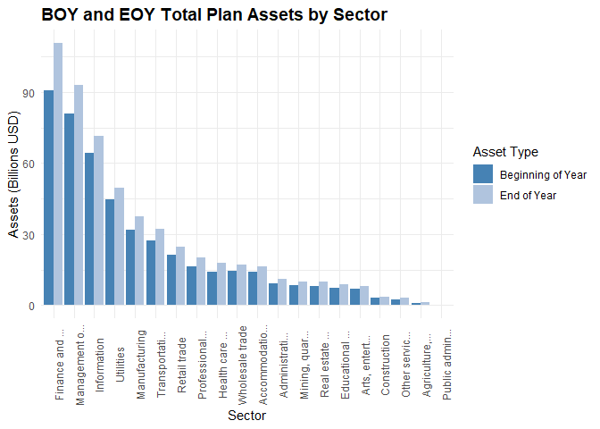<!-- -->

The plot reveals substantial variation in asset magnitude and growth
across the economic landscape.

Manufacturing leads with the highest asset levels, suggesting strong
plan stability or growth. Finance and Insurance, Health Care, and
Professional Services also show robust asset volumes, reinforcing their
structural weight in the retirement ecosystem. In contrast, sectors like
Public Administration, Agriculture, and Arts & Entertainment show
significantly lower asset totals, underscoring potential disparities in
plan availability or funding adequacy.

The dual-bar format highlights year-over-year changes, with most sectors
showing modest asset growth, though the magnitude varies.

This visualization is particularly valuable for stakeholders seeking to
understand sector-level disparities, benchmark asset performance, and
identify areas where retirement plan adequacy may be structurally
constrained.

## Total Assets Growth Rate

**TOTAL_ASSETS_GROWTH_RATE**

Create a growth rate and assets per participant for each plan.

``` r
plans <- plans %>%
  mutate(TOTAL_ASSETS_GROWTH_RATE = round((TOTAL_ASSETS_EOY - TOTAL_ASSETS_BOY) / TOTAL_ASSETS_BOY, 4))
```

Produce a density plot to show the distribution of asset growth rates.

``` r
ggplot(plans, aes(x = TOTAL_ASSETS_GROWTH_RATE)) +
  geom_density(fill = "steelblue", alpha = 0.6) +
  scale_y_continuous(labels = scales::percent_format(scale = 1, accuracy = 0.1)) +
  geom_vline(xintercept = 0, linetype = "dashed", color = "gray40") +
  labs(title = "Density of Total Assets Growth Rates",
       x = "Growth Rate",
       y = "Density (%)") +
  theme_minimal() +
  theme(axis.text.x = element_text(angle = 0, hjust = 0.5),
        plot.title = element_text(size = 14, face = "bold"))
```

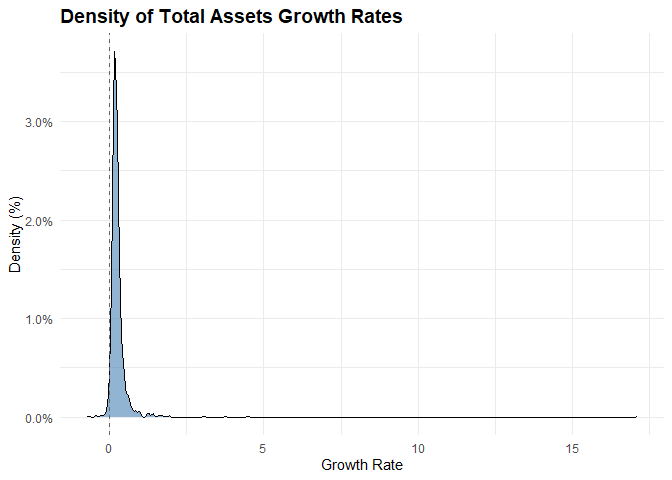<!-- -->

Most plans have modest or stagnant asset growth, likely reflecting
market conditions, contribution behavior, or plan maturity.

The right skew indicates there is a subset of plans with strong growth,
possibly due to rollovers, mergers, or aggressive investment strategies.

Create a ridgeline plot by sector. I exclude outliers to visualize
pattern better across sectors.

``` r
ggplot(plans %>%
         filter(TOTAL_ASSETS_GROWTH_RATE < 0.1 & TOTAL_ASSETS_GROWTH_RATE > -0.1), 
       aes(x = TOTAL_ASSETS_GROWTH_RATE, y = SECTOR_TITLE_SHORT)) +
  geom_density_ridges(bandwidth = 0.05, fill = "steelblue", alpha = 0.6) +
  labs(title = "Density of Total Assets Growth Rates by Sector",
       subtitle = "Growth Rates Between -10% and 10%",
       x = "Growth Rate",
       y = "Sector") +
  theme_minimal() +
  theme(axis.text.x = element_text(angle = 0, hjust = 0.5),
        plot.title = element_text(size = 14, face = "bold"))
```

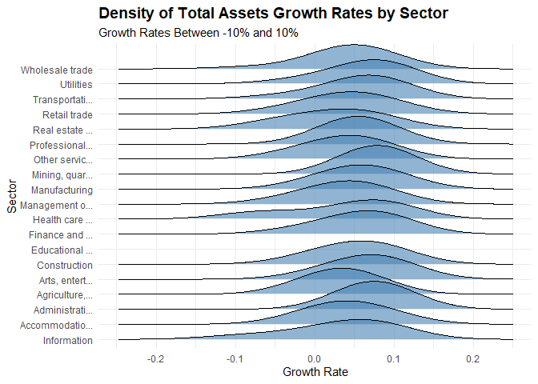<!-- -->

Most sectors show asset growth rates tightly clustered around 0%,
indicating overall stability.

## Total Assets Growth Tier

**TOTAL_ASSETS_GROWTH_TIER**

Create total assets growth tiers.

``` r
plans <- plans %>%
  mutate(
    TOTAL_ASSETS_GROWTH_TIER = case_when(
      TOTAL_ASSETS_GROWTH_RATE > 0.25 ~ "High",
      TOTAL_ASSETS_GROWTH_RATE < 0.125 ~ "Negative", 
      TRUE ~ "Typical"),
    TOTAL_ASSETS_GROWTH_TIER = factor(TOTAL_ASSETS_GROWTH_TIER,
                           levels = c("Negative", "Typical", "High"),
                           ordered = TRUE))
```

Plot density by tier.

``` r
summary_by_total_assets_growth_tier <- plans %>%
  group_by(TOTAL_ASSETS_GROWTH_TIER) %>%
  summarise(entries = n()) %>%
  mutate(percent = round(entries / sum(entries), 2))

ggplot(summary_by_total_assets_growth_tier, aes(x = TOTAL_ASSETS_GROWTH_TIER, y = entries)) +
  geom_col(fill = "steelblue", color = "white") +
  geom_text(aes(label = paste0(scales::comma(entries), "\n", round(percent * 100, 0), "%")),
            vjust = -0.3, size = 3.0) +
  labs(title = "Distribution of Plans By Total Assets Growth Tier",
       x = "Tier",
       y = "Plans") +
  theme_minimal() +
  theme(axis.text.x = element_text(angle = 0, hjust = 0.5),
        plot.title = element_text(size = 14, face = "bold")) +
  expand_limits(y = max(summary_by_total_assets_growth_tier$entries) * 1.2)
```

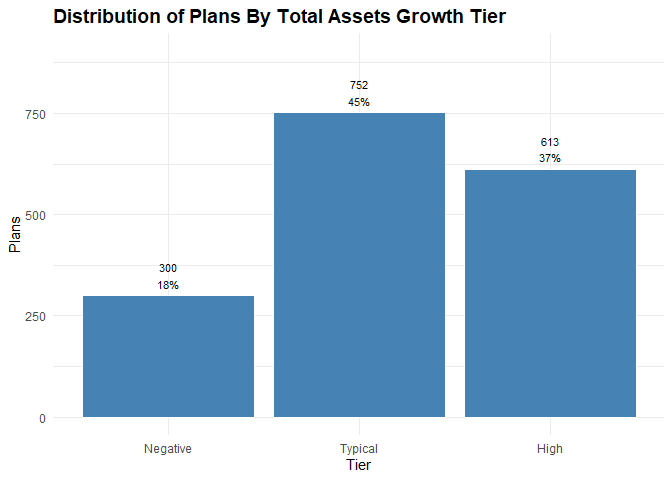<!-- -->

Nearly half of all plans fall into the “Typical” growth tier, signaling
stable asset expansion across the board. 36% of plans show high growth,
suggesting strong performance in a sizable segment. The remaining 18%
with negative growth highlight a meaningful minority facing financial
headwinds. This tiered distribution provides a clear snapshot of plan
vitality and divergence.

## Assets Per Participant

**ASSETS_PER_PARTCP**

Engineer an assets per participant variable.

``` r
plans <- plans %>%
  mutate(ASSETS_PER_PARTCP = round(TOTAL_ASSETS_EOY / TOTAL_ACCBAL_PARTCP_EOY, 0))
```

Plot assets per participant.

``` r
ggplot(plans, aes(x = ASSETS_PER_PARTCP)) +
  geom_density(fill = "steelblue", alpha = 0.6) +
  geom_vline(xintercept = mean(plans$ASSETS_PER_PARTCP, na.rm = TRUE), 
             linetype = "dashed", color = "darkred") +
  scale_y_continuous(labels = scales::percent_format(scale = 1, accuracy = 0.00001)) +
  scale_x_continuous(labels = scales::comma) +
  labs(title = "Density of Assets per Participant",
       x = "Assets Per Participant",
       y = "Density (%)") +
  theme_minimal() +
  theme(axis.text.x = element_text(angle = 0, hjust = 0.5),
        plot.title = element_text(size = 14, face = "bold"))
```

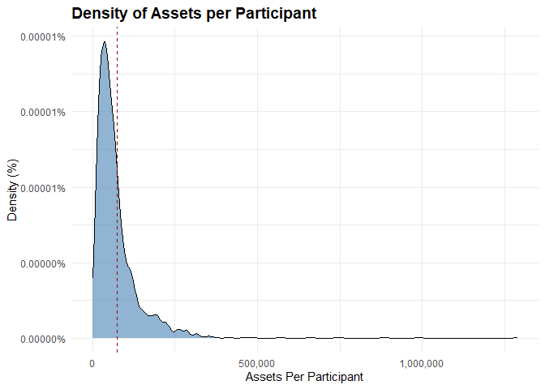<!-- -->

The sharp peak near the lower end, followed by a long right tail,
suggests most plans cluster around \$50,000 per participant with a mean
of ~\$80,000.

Plot the log-transformed distribution to reveal structure in the lower
range.

``` r
ggplot(plans, aes(x = log1p(ASSETS_PER_PARTCP))) +
  geom_density(fill = "steelblue", alpha = 0.6) +
  scale_y_continuous(labels = scales::percent_format(accuracy = 0.1)) +
  scale_x_continuous(labels = scales::comma) +
  labs(title = "Log-Scaled Density of Assets Per Participant",
       x = "log(Assets + 1)",
       y = "Density (%)") +
  theme_minimal() +
  theme(axis.text.x = element_text(angle = 0, hjust = 0.5),
        plot.title = element_text(size = 14, face = "bold"))
```

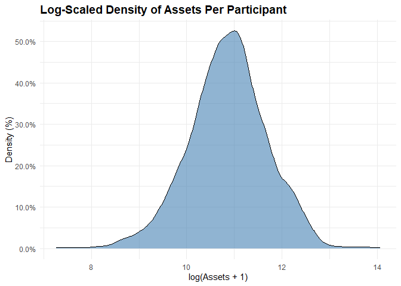<!-- -->

Most plans are below the mean: The log transformation shows that the
bulk of plans have assets per participant of ~\$59,000.

## Assets Per Participant Tier

**ASSETS_PER_PARTCP_TIER**

Create assets per participant tiers.

``` r
plans <- plans %>%
  mutate(
    ASSETS_PER_PARTCP_TIER = case_when(
      ASSETS_PER_PARTCP < 50000 ~ "Low",
      ASSETS_PER_PARTCP >= 50000 & ASSETS_PER_PARTCP < 100000 ~ "Moderate",
      ASSETS_PER_PARTCP >= 100000 ~ "High",
      TRUE ~ NA_character_),
    ASSETS_PER_PARTCP_TIER = factor(ASSETS_PER_PARTCP_TIER,
                           levels = c("Low", "Moderate", "High"),
                           ordered = TRUE))
```

Plot density by tier.

``` r
summary_by_assets_per_partcp_tier <- plans %>%
  group_by(ASSETS_PER_PARTCP_TIER) %>%
  summarise(entries = n()) %>%
  mutate(percent = round(entries / sum(entries), 2))

ggplot(summary_by_assets_per_partcp_tier, aes(x = ASSETS_PER_PARTCP_TIER, y = entries)) +
  geom_col(fill = "steelblue", color = "white") +
  geom_text(aes(label = paste0(scales::comma(entries), "\n", round(percent * 100, 0), "%")),
            vjust = -0.3, size = 3.0) +
  labs(title = "Distribution of Plans By Assets Per Participant Tier",
       x = "Tier",
       y = "Plans") +
  theme_minimal() +
  theme(axis.text.x = element_text(angle = 0, hjust = 0.5),
        plot.title = element_text(size = 14, face = "bold")) +
  expand_limits(y = max(summary_by_assets_per_partcp_tier$entries) * 1.2)
```

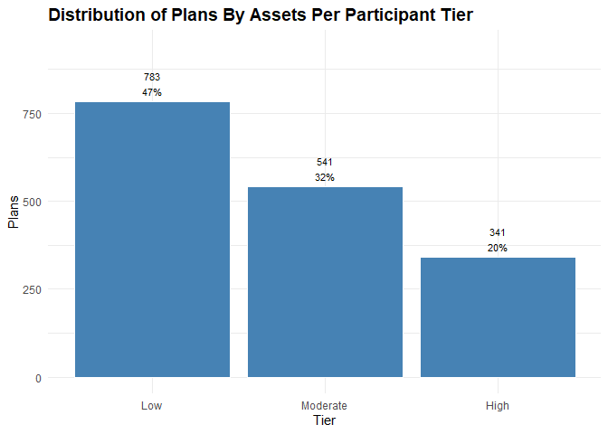<!-- -->

The distribution of plans by assets per participant reveals a clear skew
toward lower tiers. Over 40% of plans fall into the “Low” category,
while just 23% qualify as “High.” Most plans operate with relatively
modest asset levels per participant, which may reflect sector
constraints, legacy plan structures, or limited growth.

The “Moderate” tier, at 36%, anchors the middle ground but still trails
the low tier. Overall, the distribution highlights a long tail of low
savings per participant, reinforcing the need for adequacy diagnostics
and tier-aware benchmarking.

## Total Participants with Account Balances

**TOTAL_ACCBAL_PARTCP_BOY, TOTAL_ACCBAL_PARTCP_EOY**

These variables provide the number of active participants in the plan
with account balances as of the start and end of the reporting year.

``` r
summary_by_accbal_participants <- plans %>%
  group_by(SECTOR_TITLE_SHORT) %>%
  summarise(total_active_boy = sum(TOTAL_ACCBAL_PARTCP_BOY),
            total_active_eoy = sum(TOTAL_ACCBAL_PARTCP_EOY))

kable(summary_by_accbal_participants,
      col.names = c("Sector", "BOY Participants", "EOY Participants"),
      caption = "BOY and EOY Total Active Participants By Sector",
      format.args = list(big.mark = ","),
      align = c("l", "r", "r"))
```

| Sector          | BOY Participants | EOY Participants |
|:----------------|-----------------:|-----------------:|
| Information     |          423,013 |          408,167 |
| Accommodatio…   |          327,109 |          349,621 |
| Administrati…   |          198,630 |          215,466 |
| Agriculture,…   |           25,286 |           27,491 |
| Arts, entert…   |          130,618 |          136,029 |
| Construction    |           50,835 |           56,027 |
| Educational …   |           68,458 |           71,580 |
| Finance and …   |          627,844 |          646,828 |
| Health care …   |          232,177 |          237,123 |
| Management o…   |          553,675 |          534,047 |
| Manufacturing   |          238,594 |          248,145 |
| Mining, quar…   |           75,301 |           75,668 |
| Other servic…   |           58,421 |           58,947 |
| Professional…   |          173,689 |          165,116 |
| Public admin…   |            5,571 |            6,181 |
| Real estate …   |          146,385 |          156,752 |
| Retail trade    |          406,251 |          417,244 |
| Transportati…   |          308,876 |          311,052 |
| Utilities       |          233,176 |          234,782 |
| Wholesale trade |          162,134 |          160,716 |

BOY and EOY Total Active Participants By Sector

Plot active participants by sector.

``` r
active_long <- summary_by_accbal_participants %>%
  pivot_longer(cols = c(total_active_boy, total_active_eoy),
               names_to = "Active_Type",
               values_to = "Active_Value")

ggplot(active_long, aes(x = reorder(SECTOR_TITLE_SHORT, -Active_Value), 
                        y = Active_Value / 1e9, 
                        fill = Active_Type)) +
  geom_bar(stat = "identity", position = "dodge") +
    scale_fill_manual(values = c("total_active_boy" = "steelblue", 
                                 "total_active_eoy" = "lightsteelblue"),
                      labels = c("total_active_boy" = "Beginning of Year", 
                                 "total_active_eoy" = "End of Year")) +
  labs(title = "BOY and EOY Total Active Participants by Sector",
       x = "Sector",
       y = "Active Participants",
       fill = "Active Type") +
  theme_minimal() +
  theme(axis.text.x = element_text(angle = 90, hjust = 0.5),
        plot.title = element_text(size = 14, face = "bold"))
```

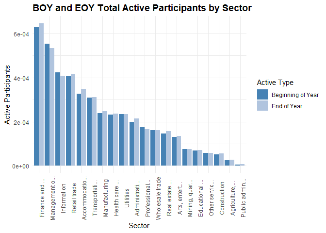<!-- -->

Manufacturing, Healthcare, and Professional Services again dominate in
participant volume, mirroring their asset dominance. Sectors like
Retail, Accommodation, and Arts show modest participant counts.

The EOY bars generally exceed BOY, suggesting net growth in active
participation, but the magnitude varies by sector.

## Participant Growth Rate

**PARTCP_GROWTH_RATE**

Engineer participant growth rate at the plan level.

``` r
plans <- plans %>%
  mutate(PARTCP_GROWTH_RATE = round((TOTAL_ACCBAL_PARTCP_EOY - TOTAL_ACCBAL_PARTCP_BOY) / TOTAL_ACCBAL_PARTCP_BOY, 4))
```

Produce a density plot to show the distribution of participant growth
rates.

``` r
ggplot(plans, aes(x = PARTCP_GROWTH_RATE)) +
  geom_density(fill = "steelblue", alpha = 0.6) +
  geom_vline(xintercept = 0, linetype = "dashed", color = "gray40") +
  labs(title = "Density of Participant Growth Rates",
       x = "Growth Rate",
       y = "Density (%)") +
  theme_minimal() +
  theme(axis.text.x = element_text(angle = 0, hjust = 0.5),
        plot.title = element_text(size = 14, face = "bold"))
```

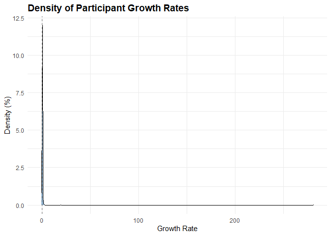<!-- -->

Most participant growth rates cluster tightly around zero, indicating
minimal change for the majority. The long right tail reveals a small
group experiencing significantly higher growth, suggesting outliers with
rapid expansion. The overall distribution is sharply peaked and
right-skewed.

Create a ridgeline plot by sector. I exclude outliers to visualize
pattern better across sectors.

``` r
  ggplot(plans %>%
           filter(PARTCP_GROWTH_RATE < 0.5 & PARTCP_GROWTH_RATE > -0.5),
         aes(x = PARTCP_GROWTH_RATE, y = SECTOR_TITLE_SHORT)) +
  geom_density_ridges(bandwidth = 0.05, fill = "steelblue", alpha = 0.6) +
  labs(title = "Participant Growth Rate by Sector",
       subtitle = "Growth Rates Between -50% and 50%",
       x = "Growth Rate",
       y = "Sector") +
  theme_minimal() +
  theme(axis.text.x = element_text(angle = 0, hjust = 0.5),
        plot.title = element_text(size = 14, face = "bold"))
```

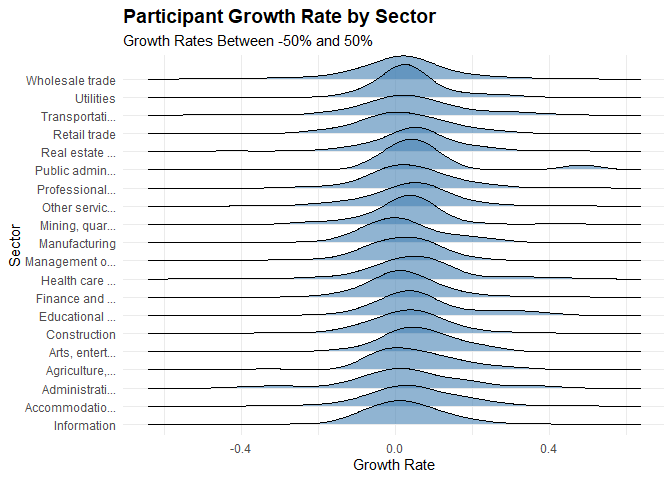<!-- -->

Participant growth rates across sectors are tightly centered around
zero, indicating modest or stable expansion in most industries. However,
some sectors show wider distributions, revealing greater variability in
participant dynamics.

## Participant Growth Rate Tier

**PARTCP_GROWTH_TIER**

Create participant growth tiers.

``` r
plans <- plans%>%
  mutate(PARTCP_GROWTH_TIER = case_when(PARTCP_GROWTH_RATE > 0.05 ~ "High",
                                        PARTCP_GROWTH_RATE < -0.05 ~ "Negative",
                                        TRUE ~ "Typical"),
             PARTCP_GROWTH_TIER = factor(PARTCP_GROWTH_TIER,
                                levels = c("Negative", "Typical", "High"),
                                ordered = TRUE))
```

Plot participant growth rates by sector with the growth tiers.

``` r
summary_by_partcp_growth_tier <- plans %>%
  group_by(PARTCP_GROWTH_TIER) %>%
  summarise(entries = n()) %>%
  mutate(percent = round(entries / sum(entries), 2))

ggplot(summary_by_partcp_growth_tier, aes(x = PARTCP_GROWTH_TIER, y = entries)) +
  geom_col(fill = "steelblue", color = "white") +
  geom_text(aes(label = paste0(scales::comma(entries), "\n", round(percent * 100, 0), "%")),
            vjust = -0.3, size = 3.0) +
  labs(title = "Distribution of Plans By Participant Growth Tier",
       x = "Tier",
       y = "Plans") +
  theme_minimal() +
  theme(axis.text.x = element_text(angle = 0, hjust = 0.5),
        plot.title = element_text(size = 14, face = "bold")) +
  expand_limits(y = max(summary_by_partcp_growth_tier$entries) * 1.2)
```

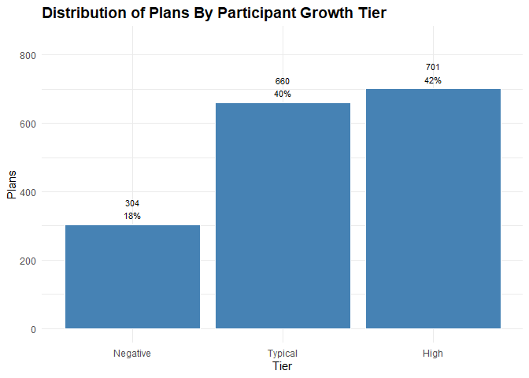<!-- -->

Plans are nearly evenly split between high and typical participant
growth tiers, at 42% and 41% respectively. This indicates strong or
stable expansion for most. 18% fall into the negative tier, highlighting
a notable subset experiencing participant decline.

## Total Participant Contributions

**TOTAL_CONTRIB_PARTCP_BOY, TOTAL_CONTRIB_PARTCP_EOY**

These variables capture the total dollar amount of participant
contributions on record as of the start and end of the reporting year.
The first reflects contributions made prior to the current plan year but
still held in the plan. This is useful for understanding carryover
balances or prior-year contribution momentum.

The latter includes all contributions made by participants during the
year, plus any prior balances still retained. It is often used to assess
current-year contribution activity and participant engagement.

``` r
summary_by_partcp_contributions <- plans %>%
  group_by(SECTOR_TITLE_SHORT) %>%
  summarise(total_contrib_boy = sum(TOTAL_CONTRIB_PARTCP_BOY),
            total_contrib_eoy = sum(TOTAL_CONTRIB_PARTCP_EOY),
            .groups = "drop")

kable(summary_by_partcp_contributions,
      col.names = c("Sector", "BOY Contributions", "EOY Contributions"),
      caption = "BOY and EOY Total Contributions By Sector",
      format.args = list(big.mark = ","),
      align = c("l", "r", "r"))
```

| Sector          | BOY Contributions | EOY Contributions |
|:----------------|------------------:|------------------:|
| Information     |        42,667,048 |        43,371,288 |
| Accommodatio…   |        11,211,435 |        14,488,075 |
| Administrati…   |        13,006,759 |        11,502,389 |
| Agriculture,…   |         2,277,913 |         1,850,532 |
| Arts, entert…   |         9,343,780 |        11,793,812 |
| Construction    |         4,551,799 |         4,841,884 |
| Educational …   |         4,093,220 |         5,659,145 |
| Finance and …   |        93,803,011 |       110,993,284 |
| Health care …   |        10,719,709 |         9,602,888 |
| Management o…   |        55,690,422 |        61,799,450 |
| Manufacturing   |        21,395,781 |        24,163,669 |
| Mining, quar…   |         8,435,434 |        12,137,761 |
| Other servic…   |         5,135,671 |         6,194,939 |
| Professional…   |        35,967,616 |        39,738,072 |
| Public admin…   |           515,954 |           379,164 |
| Real estate …   |         5,888,442 |         5,982,260 |
| Retail trade    |        36,161,885 |        39,157,603 |
| Transportati…   |        18,478,519 |        22,476,380 |
| Utilities       |        37,633,929 |        42,356,904 |
| Wholesale trade |        21,980,495 |        23,160,689 |

BOY and EOY Total Contributions By Sector

Plot contributions by sector.

``` r
contributions_long <- summary_by_partcp_contributions %>%
  pivot_longer(cols = c(total_contrib_boy, total_contrib_eoy),
               names_to = "Contribution_Type",
               values_to = "Contribution_Value")

ggplot(contributions_long, aes(x = reorder(SECTOR_TITLE_SHORT, -Contribution_Value), 
                               y = Contribution_Value / 1e9, 
                               fill = Contribution_Type)) +
  geom_bar(stat = "identity", position = "dodge") +
    scale_fill_manual(values = c("total_contrib_boy" = "steelblue", 
                                 "total_contrib_eoy" = "lightsteelblue"),
                      labels = c("total_contrib_boy" = "Beginning of Year", 
                                 "total_contrib_eoy" = "End of Year")) +
  labs(title = "BOY and EOY Total Contributions by Sector",
       x = "Sector",
       y = "Contributions",
       fill = "Contribution Type") +
  theme_minimal() +
  theme(axis.text.x = element_text(angle = 90, hjust = 0.5),
        plot.title = element_text(size = 14, face = "bold"))
```

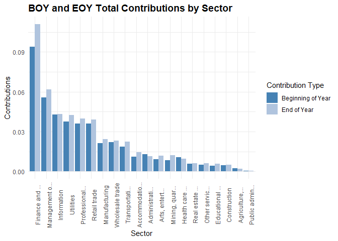<!-- -->

Manufacturing, Professional Services, and Hotels & Restaurants lead in
total contributions, echoing their asset and participant dominance.
Sectors like Information and Mining show relatively flat or modest
contribution growth, which may flag under-engagement or structural
constraints.

The EOY bars generally exceed BOY, suggesting net contribution inflows,
but the magnitude and slope vary by sector.

## Participant Contribution Growth Rate

**CONTRIB_PARTCP_GROWTH_RATE**

Engineer a contribution growth rate.

``` r
plans <- plans %>%
  mutate(CONTRIB_PARTCP_GROWTH_RATE = round((TOTAL_CONTRIB_PARTCP_EOY - TOTAL_CONTRIB_PARTCP_BOY) / TOTAL_CONTRIB_PARTCP_BOY, 4))
```

Produce a density plot to show the distribution of contribution growth
rates.

``` r
ggplot(plans, aes(x = CONTRIB_PARTCP_GROWTH_RATE)) +
  geom_density(fill = "steelblue", alpha = 0.6) +
  geom_vline(xintercept = 0, linetype = "dashed", color = "gray40") +
  labs(title = "Density of Contribution Growth Rates",
       x = "Growth Rate",
       y = "Density (%)") +
  theme_minimal() +
  theme(axis.text.x = element_text(angle = 0, hjust = 0.5),
        plot.title = element_text(size = 14, face = "bold"))
```

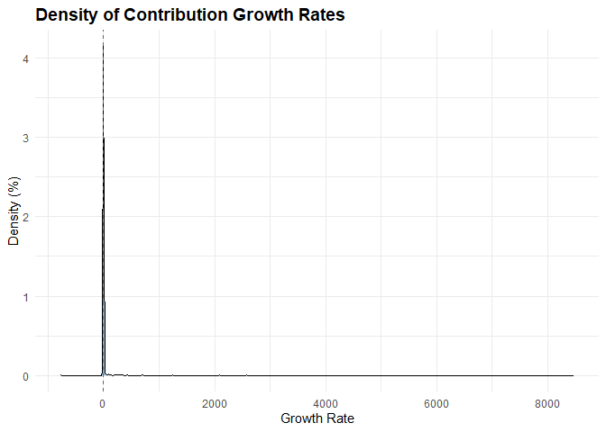<!-- -->

This is a familiar dynamic, most contribution growth rates cluster
tightly around zero, indicating minimal change for the majority. The
long right tail reveals a small group experiencing significantly higher
contribution growth. The overall distribution is sharply peaked and
right-skewed.

Create a ridgeline plot by sector, adjusted for outliers.

``` r
ggplot(plans %>%
         filter(CONTRIB_PARTCP_GROWTH_RATE < 0.5 & CONTRIB_PARTCP_GROWTH_RATE > -0.5),
       aes(x = CONTRIB_PARTCP_GROWTH_RATE, y = SECTOR_TITLE_SHORT)) +
  geom_density_ridges(bandwidth = 0.05, fill = "steelblue", alpha = 0.6) +
  labs(title = "Contribution Growth Rate by Sector",
       subtitle = "Growth Rates Between -50% and 50%",
       x = "Growth Rate",
       y = "Sector") +
  theme_minimal() +
  theme(axis.text.x = element_text(angle = 0, hjust = 0.5),
        plot.title = element_text(size = 14, face = "bold"))
```

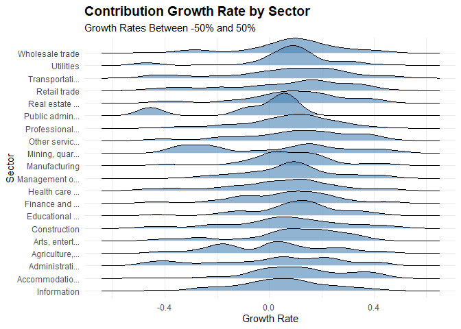<!-- -->

Contribution growth rates cluster near zero across most sectors, but
several show wide variability, especially in the tails. The presence of
negative growth rates likely reflects borrowing activity or early
withdrawals, signaling financial strain or plan leakage. This
distribution highlights sector-level differences in contribution
dynamics and potential risk exposure.

## Participant Contribution Growth Tier

**CONTRIB_PARTCP_GROWTH_TIER**

Create a contribution growth rate tiers.

``` r
plans <- plans%>%
  mutate(CONTRIB_PARTCP_GROWTH_TIER = case_when(CONTRIB_PARTCP_GROWTH_RATE > 0.10 ~ "High",
                                        CONTRIB_PARTCP_GROWTH_RATE < -0.10 ~ "Negative",
                                        TRUE ~ "Typical"),
         CONTRIB_PARTCP_GROWTH_TIER = factor(CONTRIB_PARTCP_GROWTH_TIER,
                                levels = c("Negative", "Typical", "High"),
                                ordered = TRUE))
```

Plot contribution growth tiers by sector with the growth flags.

``` r
summary_by_contrib_partcp_growth_tier <- plans %>%
  group_by(CONTRIB_PARTCP_GROWTH_TIER) %>%
  summarise(entries = n()) %>%
  mutate(percent = round(entries / sum(entries), 2))

ggplot(summary_by_contrib_partcp_growth_tier, aes(x = CONTRIB_PARTCP_GROWTH_TIER, y = entries)) +
  geom_col(fill = "steelblue", color = "white") +
  geom_text(aes(label = paste0(scales::comma(entries), "\n", round(percent * 100, 0), "%")),
            vjust = -0.3, size = 3.0) +
  labs(title = "Distribution of Plans By Participant Contribution Growth Tier",
       x = "Tier",
       y = "Plans") +
  theme_minimal() +
  theme(axis.text.x = element_text(angle = 0, hjust = 0.5),
        plot.title = element_text(size = 14, face = "bold")) +
  expand_limits(y = max(summary_by_contrib_partcp_growth_tier$entries) * 1.2)
```

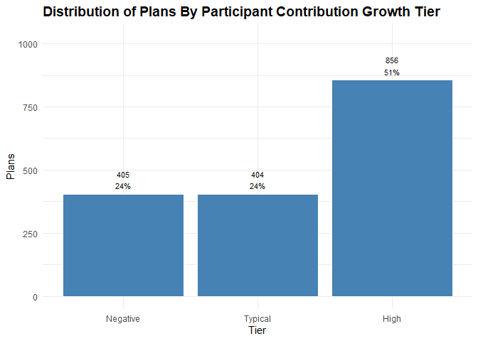<!-- -->

Half of all plans fall into the high participant contribution growth
tier, signaling strong engagement and financial momentum for these
plans. Typical growth accounts for 26%, while 24% show negative growth,
potentially reflecting borrowing or early withdrawals. The distribution
highlights both robust contribution trends and areas of concern.

## Employer Contributions

**TOTAL_CONTRIB_EMPLR_BOY, TOTAL_CONTRIB_EMPLR_EOY**

These variables represent the total dollar amount of employer
contributions on record as of the start and end of the reporting year.
They include contributions made during the year plus any retained prior
balances and are often used to assess current-year employer funding and
plan support.

``` r
summary_er_contributions <- plans %>%
  group_by(SECTOR_TITLE_SHORT) %>%
  summarise(total_contrib_boy = sum(TOTAL_CONTRIB_EMPLR_BOY),
            total_contrib_eoy = sum(TOTAL_CONTRIB_EMPLR_EOY),
            .groups = "drop")

kable(summary_er_contributions,
      col.names = c("Sector", "BOY Contributions", "EOY Contributions"),
      caption = "BOY and EOY Total Employer Contributions By Sector",
      format.args = list(big.mark = ","),
      align = c("l", "r", "r"))
```

| Sector          | BOY Contributions | EOY Contributions |
|:----------------|------------------:|------------------:|
| Information     |        75,517,677 |        76,642,832 |
| Accommodatio…   |        70,589,859 |        83,356,128 |
| Administrati…   |        40,249,952 |        47,857,677 |
| Agriculture,…   |        10,820,804 |        11,024,934 |
| Arts, entert…   |        55,585,692 |        61,738,157 |
| Construction    |        59,436,197 |        59,096,810 |
| Educational …   |        11,179,693 |        12,700,497 |
| Finance and …   |     1,802,174,619 |     2,125,535,720 |
| Health care …   |       369,314,413 |       401,068,940 |
| Management o…   |       560,528,024 |       602,883,320 |
| Manufacturing   |        85,599,625 |       125,260,954 |
| Mining, quar…   |        41,244,762 |        55,229,699 |
| Other servic…   |        14,596,707 |        13,784,144 |
| Professional…   |        67,548,425 |        72,172,133 |
| Public admin…   |           287,607 |           316,815 |
| Real estate …   |       244,234,009 |       302,660,959 |
| Retail trade    |       150,769,154 |       157,219,043 |
| Transportati…   |       210,247,327 |       614,990,246 |
| Utilities       |       184,293,009 |       207,337,756 |
| Wholesale trade |        90,723,328 |        52,832,114 |

BOY and EOY Total Employer Contributions By Sector

Plot contributions by sector.

``` r
er_contributions_long <- summary_er_contributions %>%
  pivot_longer(cols = c(total_contrib_boy, total_contrib_eoy),
               names_to = "Contribution_Type",
               values_to = "Contribution_Value")

ggplot(er_contributions_long, aes(x = reorder(SECTOR_TITLE_SHORT, -Contribution_Value), 
                                  y = Contribution_Value / 1e9, 
                                  fill = Contribution_Type)) +
  geom_bar(stat = "identity", position = "dodge") +
    scale_fill_manual(values = c("total_contrib_boy" = "steelblue", 
                                 "total_contrib_eoy" = "lightsteelblue"),
                      labels = c("total_contrib_boy" = "Beginning of Year", 
                                 "total_contrib_eoy" = "End of Year")) +
  labs(title = "BOY and EOY Total Employer Contributions by Sector",
       x = "Sector",
       y = "Contributions",
       fill = "Contribution Type") +
  theme_minimal() +
  theme(axis.text.x = element_text(angle = 90, hjust = 0.5),
        plot.title = element_text(size = 14, face = "bold"))
```

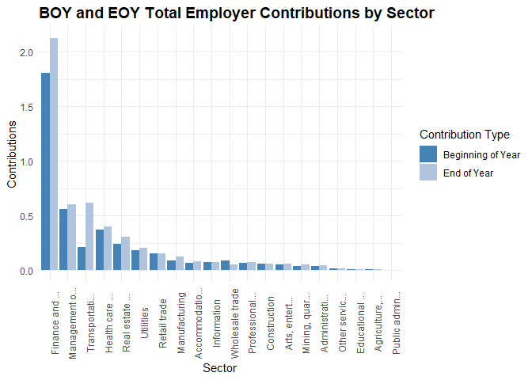<!-- -->

Health care, Manufacturing, and Professional Services lead in employer
contributions at both BOY and EOY, suggesting sustained institutional
support. Sectors like Arts & Entertainment, Accommodation, and
Administrative Support show relatively low employer contributions, which
could signal structural gaps in plan generosity.

The EOY bars generally exceed BOY, indicating net inflows, but the slope
varies by sector. Some sectors show flat or modest growth..

## Employer Contribution Growth Rate

**CONTRIB_EMPLR_GROWTH_RATE**

Engineer a contribution growth rate.

``` r
plans <- plans %>%
  mutate(CONTRIB_EMPLR_GROWTH_RATE = round((TOTAL_CONTRIB_EMPLR_EOY - TOTAL_CONTRIB_EMPLR_BOY) / TOTAL_CONTRIB_EMPLR_BOY, 4))
```

Produce a density plot to show the distribution of contribution growth
rates.

``` r
ggplot(plans, aes(x = CONTRIB_EMPLR_GROWTH_RATE)) +
  geom_density(fill = "steelblue", alpha = 0.6) +
  geom_vline(xintercept = 0, linetype = "dashed", color = "gray40") +
  labs(title = "Density of Employer Contribution Growth Rates",
       x = "Growth Rate",
       y = "Density") +
  theme_minimal() +
  theme(axis.text.x = element_text(angle = 0, hjust = 0.5),
        plot.title = element_text(size = 14, face = "bold"))
```

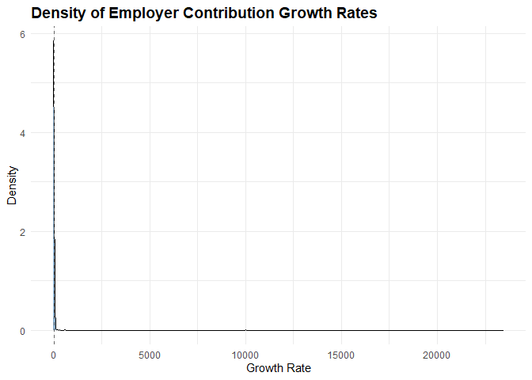<!-- -->

Tight clustering around zero with a long tail.

Create a ridgeline plot by sector, filter high values.

``` r
  ggplot(plans %>%
           filter(CONTRIB_EMPLR_GROWTH_RATE < 0.10 & CONTRIB_EMPLR_GROWTH_RATE > -0.10),
         aes(x = CONTRIB_EMPLR_GROWTH_RATE, y = SECTOR_TITLE_SHORT)) +
  geom_density_ridges(bandwidth = 0.05, fill = "steelblue", alpha = 0.6) +
  labs(title = "Employer Contribution Growth Rate by Sector",
       subtitle = "Growth Rates Between -10% and 10%",
       x = "Growth Rate",
       y = "Sector") +
  theme_minimal() +
  theme(axis.text.x = element_text(angle = 90, hjust = 0.5),
        plot.title = element_text(size = 14, face = "bold"))
```

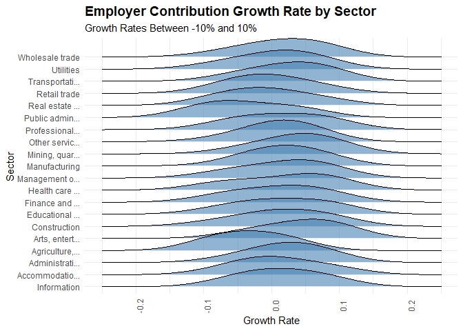<!-- -->

Employer contribution growth rates are tightly centered around zero
across most sectors, indicating general stability. However, some sectors
show wider spreads, suggesting variability in employer funding behavior.

## Employer Contribution Growth Tier

**CONTRIB_EMPLR_GROWTH_TIER**

Create employer contribution growth tiers.

``` r
plans <- plans%>%
  mutate(CONTRIB_EMPLR_GROWTH_TIER = case_when(CONTRIB_EMPLR_GROWTH_RATE > 0.10 ~ "High",
                                               CONTRIB_EMPLR_GROWTH_RATE < -0.10 ~ "Negative",
                                               TRUE ~ "Typical"),
         CONTRIB_EMPLR_GROWTH_TIER = factor(CONTRIB_EMPLR_GROWTH_TIER,
                                levels = c("Negative", "Typical", "High"),
                                ordered = TRUE))
```

Plot contribution growth rates by sector with the growth flags.

``` r
summary_by_contrib_emplr_growth_tier <- plans %>%
  group_by(CONTRIB_EMPLR_GROWTH_TIER) %>%
  summarise(entries = n()) %>%
  mutate(percent = round(entries / sum(entries), 2))

ggplot(summary_by_contrib_emplr_growth_tier, aes(x = CONTRIB_EMPLR_GROWTH_TIER, y = entries)) +
  geom_col(fill = "steelblue", color = "white") +
  geom_text(aes(label = paste0(scales::comma(entries), "\n", round(percent * 100, 0), "%")),
            vjust = -0.3, size = 3.0) +
  labs(title = "Distribution of Plans By Employer Contribution Growth Tier",
       x = "Tier",
       y = "Plans") +
  theme_minimal() +
  theme(axis.text.x = element_text(angle = 0, hjust = 0.5),
        plot.title = element_text(size = 14, face = "bold")) +
  expand_limits(y = max(summary_by_contrib_emplr_growth_tier$entries) * 1.2)
```

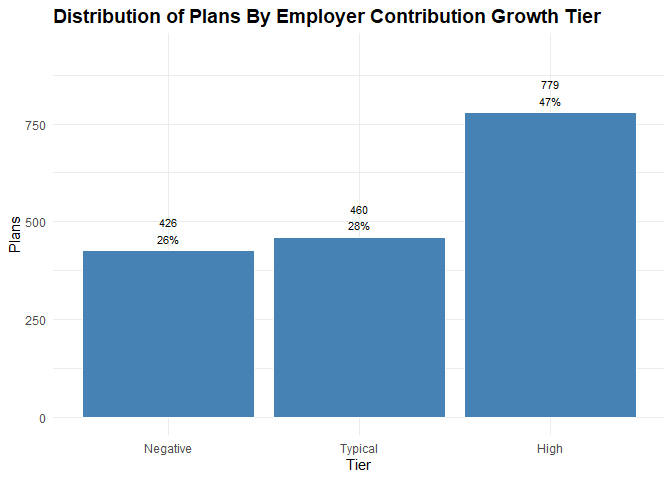<!-- -->

Nearly half of all plans fall into the high employer contribution growth
tier, signaling strong and increasing support from employers. Typical
growth accounts for 29%, while 25% of plans show negative growth,
potentially reflecting funding reductions or volatility.

## Participant Loans

**TOTAL_LOANS_BOY, TOTAL_LOANS_EOY**

These fields reflect the aggregate amount participants have borrowed
from their retirement accounts and not yet repaid. Loans are typically
allowed under 401(k) and some 403(b) plans, subject to IRS limits
(usually up to \$50,000 or 50% of vested account balance).

Comparing BOY vs. EOY values helps surface net borrowing or repayment
trends. A rising EOY balance may signal increased participant financial
stress or plan leniency.

High loan balances can erode retirement adequacy. Plans with high
loan-to-asset ratios or frequent borrowing as needing closer scrutiny.

``` r
summary_loans <- plans %>%
  group_by(SECTOR_TITLE_SHORT) %>%
  summarise(total_loans_boy = sum(TOTAL_LOANS_BOY),
            total_loans_eoy = sum(TOTAL_LOANS_EOY),
            .groups = "drop")

kable(summary_loans,
      col.names = c("Sector", "BOY Loans", "EOY Loans"),
      caption = "BOY and EOY Total Loan Balances By Sector",
      format.args = list(big.mark = ","),
      align = c("l", "r", "r"))
```

| Sector          |     BOY Loans |     EOY Loans |
|:----------------|--------------:|--------------:|
| Information     |   917,719,686 |   904,698,868 |
| Accommodatio…   |   221,835,864 |   248,070,806 |
| Administrati…   |   217,665,025 |   251,452,875 |
| Agriculture,…   |    23,805,359 |    28,090,338 |
| Arts, entert…   |   146,765,817 |   160,306,998 |
| Construction    |    46,213,355 |    54,986,776 |
| Educational …   |    39,333,300 |    44,167,636 |
| Finance and …   |   976,145,804 | 1,073,849,069 |
| Health care …   |   153,251,857 |   186,772,776 |
| Management o…   | 1,046,491,029 | 1,130,397,793 |
| Manufacturing   |   317,262,874 |   353,497,381 |
| Mining, quar…   |   142,267,726 |   159,264,265 |
| Other servic…   |    42,391,761 |    47,236,812 |
| Professional…   |   150,013,305 |   157,852,002 |
| Public admin…   |     7,827,536 |     9,157,545 |
| Real estate …   |   114,528,513 |   127,278,375 |
| Retail trade    |   309,730,486 |   350,973,729 |
| Transportati…   |   338,143,078 |   360,310,837 |
| Utilities       |   629,157,849 |   648,004,713 |
| Wholesale trade |   177,726,780 |   202,433,432 |

BOY and EOY Total Loan Balances By Sector

Plot loans by sector.

``` r
er_loans_long <- summary_loans %>%
  pivot_longer(cols = c(total_loans_boy, total_loans_eoy),
               names_to = "Loan_Type",
               values_to = "Loan_Value")

ggplot(er_loans_long, aes(x = reorder(SECTOR_TITLE_SHORT, -Loan_Value), 
                          y = Loan_Value, 
                          fill = Loan_Type)) +
  geom_bar(stat = "identity", position = "dodge") +
    scale_fill_manual(values = c("total_loans_boy" = "steelblue", 
                                 "total_loans_eoy" = "lightsteelblue"),
                      labels = c("total_loans_boy" = "Beginning of Year", 
                                 "total_loans_eoy" = "End of Year")) +
  labs(title = "BOY and EOY Total Loan Balances by Sector",
       x = "Sector",
       y = "Loans",
       fill = "Loan Type") +
  theme_minimal() +
  theme(axis.text.x = element_text(angle = 90, hjust = 0.5),
        plot.title = element_text(size = 14, face = "bold"))
```

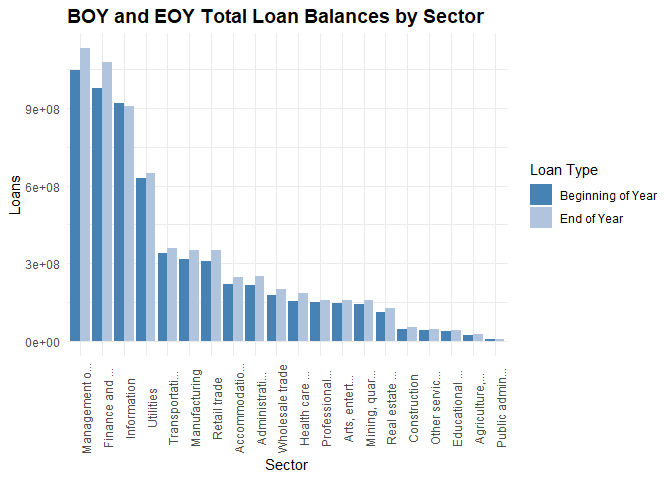<!-- -->

Loan balances are rising in most sectors. That’s a potential red flag
for participant liquidity strain or plan leniency.

Manufacturing leads in total loan volume. These sectors show the highest
absolute balances, likely due to large participant bases and higher plan
penetration. Professional and Technical Services show modest growth.
Possibly reflecting more conservative borrowing behavior or stronger
financial wellness programs.

## Loan Leakage Ratio

**LOAN_LEAKAGE_RATIO**

Create a loan leakage ratio feature.

``` r
plans <- plans %>%
  mutate(LOAN_LEAKAGE_RATIO = round(TOTAL_LOANS_EOY / TOTAL_ASSETS_EOY, 4))
```

# Loan Leakage Tier

**LOAN_LEAKAGE_TIER**

Create loan leakage tiers.

``` r
plans <- plans %>%
  mutate(LOAN_LEAKAGE_TIER = case_when(LOAN_LEAKAGE_RATIO <= 0.015 ~ "Low",
                                       LOAN_LEAKAGE_RATIO <= 0.03 ~ "Moderate",
                                       TRUE ~ "High"),
         LOAN_LEAKAGE_TIER = factor(LOAN_LEAKAGE_TIER,
                                    levels = c("Low", "Moderate", "High"),
                                    ordered = TRUE))
```

Plot loan leakage tier.

``` r
summary_by_loan_leakage_tier <- plans %>%
  group_by(LOAN_LEAKAGE_TIER) %>%
  summarise(entries = n()) %>%
  mutate(percent = round(entries / sum(entries), 2))

ggplot(summary_by_loan_leakage_tier, aes(x = LOAN_LEAKAGE_TIER, y = entries)) +
  geom_col(fill = "steelblue", color = "white") +
  geom_text(aes(label = paste0(scales::comma(entries), "\n", round(percent * 100, 0), "%")),
            vjust = -0.3, size = 3.0) +
  labs(title = "Distribution of Plans By Loan Leakage Tier",
       x = "Tier",
       y = "Plans") +
  theme_minimal() +
  theme(axis.text.x = element_text(angle = 0, hjust = 0.5),
        plot.title = element_text(size = 14, face = "bold")) +
  expand_limits(y = max(summary_by_loan_leakage_tier$entries) * 1.2)
```

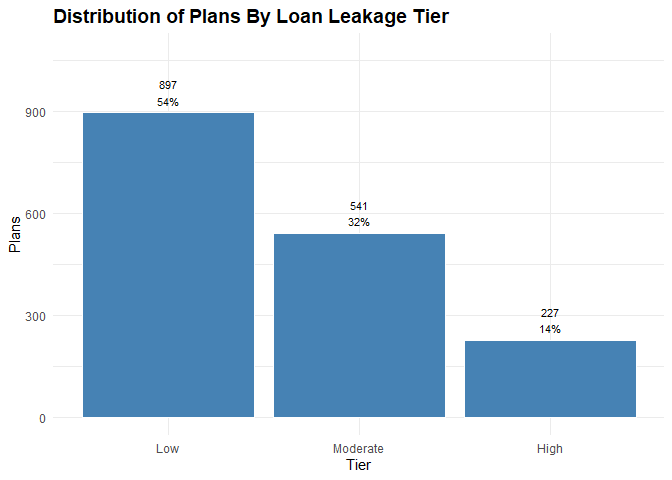<!-- -->

Over half of all plans fall into the low loan leakage tier, suggesting
strong retention and minimal borrowing activity. 31% show moderate
leakage, and 12% fall into the high tier, highlighting a smaller but
notable group at risk of financial strain or early withdrawals.

## Retirement Adequacy Score

**ADEQUACY_SCORE, ADEQUACY_IND, ADEQUACY_LABEL**

This response variable is designed to classify retirement plans as
adequate or inadequate based on a principled, multi-signal framework.
Rather than relying on a single metric, it integrates six structural
indicators of plan health:

- Assets per Participant \> \$59,000 signals long-term saving capacity
  and participant wealth accumulation,
- Asset Growth Rate \> 10% reflects sustained engagement and overall
  plan financial momentum over time,
- Participant Growth Rate \> 3% signals strong plan adoption by
  employees,
- Participant Contribution Growth Rate \> 10% indicates meaningful
  participant deferral behavior and plan utilization,
- Employer Contribution Growth Rate \> 7% indicates meaningful employer
  support for employee financial wellness, and
- Loan Leakage Ratio \< 1.3% captures erosion risk due to participant
  borrowing; lower ratios suggest stronger adequacy.

Each condition is evaluated as a binary flag, and the adequacy score is
the sum of conditions met. Plans meeting four or more criteria are
classified as adequate.

``` r
plans <- plans %>%
  mutate(ADEQUACY_SCORE = (ASSETS_PER_PARTCP > 59000) +
                          (TOTAL_ASSETS_GROWTH_RATE > 0.10) +
                          (PARTCP_GROWTH_RATE > 0.03) +
                          (CONTRIB_PARTCP_GROWTH_RATE > 0.10) + 
                          (CONTRIB_EMPLR_GROWTH_RATE > 0.07) + 
                          (LOAN_LEAKAGE_RATIO < 0.013),
         ADEQUACY_IND = factor(if_else(ADEQUACY_SCORE >= 4, 1L, 0L),
                               levels = c(0L, 1L)),
         ADEQUACY_LABEL = factor(if_else(ADEQUACY_SCORE >= 4, "Adequate", "Inadequate"),
                                 levels = c("Inadequate", "Adequate")))
```

This approach offers several advantages. Stakeholders can trace adequacy
classification to specific, transparent thresholds. Each component
reflects a distinct dimension of plan health, accumulation, growth,
engagement, and leakage. By leveraging multiple criteria, the model
avoids overfitting to any one sector or plan type. And the binary label
supports classification tasks, while the tiered label enables
stakeholder previews and fairness overlays.

This response variable scaffolds ethical modeling, stakeholder trust,
and reproducible diagnostics, all central to my analytic philosophy for
this project.

Summarize plans by adequacy score.

``` r
summary_by_adequacy_score <- plans %>%
  group_by(ADEQUACY_SCORE) %>%
  summarise(entries = n()) %>%
  mutate(percent = round(entries / sum(entries), 2))

kable(summary_by_adequacy_score,
      col.names = c("Adequacy Score", "Plans", "Percent"),
      caption = "Summary By Adequacy Score",
      format.args = list(big.mark = ","),
      align = c("l", "r", "r"))
```

| Adequacy Score | Plans | Percent |
|:---------------|------:|--------:|
| 0              |    26 |    0.02 |
| 1              |   136 |    0.08 |
| 2              |   307 |    0.18 |
| 3              |   406 |    0.24 |
| 4              |   434 |    0.26 |
| 5              |   255 |    0.15 |
| 6              |   101 |    0.06 |

Summary By Adequacy Score

Plot adequacy distribution.

``` r
ggplot(summary_by_adequacy_score, aes(x = ADEQUACY_SCORE, y = entries)) +
  geom_col(fill = "steelblue", color = "white") +
  geom_text(aes(label = paste0(scales::comma(entries), "\n", round(percent * 100, 0), "%")),
            vjust = -0.3, size = 3.0) +
  labs(title = "Distribution of Adequacy Scores",
       x = "Adequacy Score",
       y = "Number of Plans") +
  theme_minimal() +
  theme(axis.text.x = element_text(angle = 0, hjust = 0.5),
        plot.title = element_text(size = 14, face = "bold")) +
  expand_limits(y = max(summary_by_adequacy_score$entries) * 1.2)
```

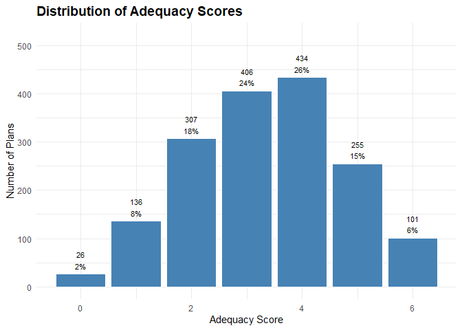<!-- -->

Most plans score between 3 and 4, suggesting moderate adequacy, while
very few meet all six criteria. This distribution highlights a central
tendency with room for improvement in comprehensive plan strength.

Plot distribution by adequacy class.

``` r
summary_by_adequacy_class <- plans %>%
  group_by(ADEQUACY_LABEL) %>%
  summarise(entries = n()) %>%
  mutate(percent = round(entries / sum(entries), 2))

ggplot(summary_by_adequacy_class, aes(x = ADEQUACY_LABEL, y = entries)) +
  geom_col(fill = "steelblue", color = "white") +
  geom_text(aes(label = paste0(scales::comma(entries), "\n", round(percent * 100, 0), "%")),
            vjust = -0.3, size = 3.0) +
  labs(title = "Distribution of Adequacy Class",
       x = "Adequacy Class",
       y = "Number of Plans") +
  theme_minimal() +
  theme(axis.text.x = element_text(angle = 0, hjust = 0.5),
        plot.title = element_text(size = 14, face = "bold")) +
  expand_limits(y = max(summary_by_adequacy_class$entries) * 1.2)
```

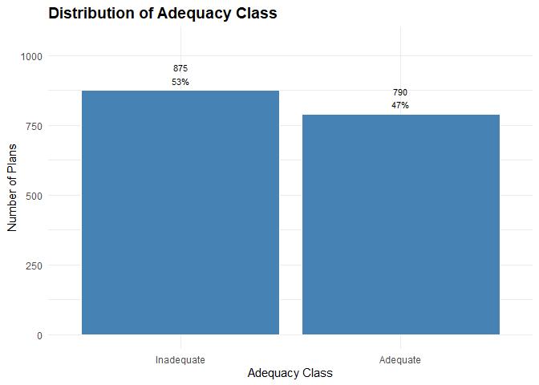<!-- -->

Just over half of plans are classified as inadequate (51%), while 49%
meet adequacy criteria, revealing a near-even split. This suggests that
while many plans show structural strength, a slight majority still fall
short on key indicators like contributions, growth, or leakage. The
distribution underscores the need for targeted improvement across the
plan landscape.

# Quartile-Based Predictor Tiers

**ASSETS_PER_PARTCP_TIER_Q, TOTAL_ASSETS_GROWTH_TIER_Q,
PARTCP_GROWTH_TIER_Q, CONTRIB_PARTCP_GROWTH_TIER_Q,
CONTRIB_EMPLR_GROWTH_TIER_Q, LOAN_LEAKAGE_TIER_Q**

Generate a standard set of sector-specific tiers based on quartiles for
model prediction. This ensures tiers are derived relative to the sample
and not the adequacy cutoffs I used to create the response variable.

``` r
plans <- plans %>%
  group_by(SECTOR_TITLE_SHORT) %>%
  mutate(
    ASSETS_PER_PARTCP_TIER_Q = ntile(ASSETS_PER_PARTCP, 4),
    TOTAL_ASSETS_GROWTH_TIER_Q = ntile(TOTAL_ASSETS_GROWTH_RATE, 4),
    PARTCP_GROWTH_TIER_Q = ntile(PARTCP_GROWTH_RATE, 4),
    CONTRIB_PARTCP_GROWTH_TIER_Q = ntile(CONTRIB_PARTCP_GROWTH_RATE, 4),
    CONTRIB_EMPLR_GROWTH_TIER_Q = ntile(CONTRIB_EMPLR_GROWTH_RATE, 4),
    LOAN_LEAKAGE_TIER_Q = ntile(LOAN_LEAKAGE_RATIO, 4)
  ) %>%
  ungroup() %>%
  mutate(
    ASSETS_PER_PARTCP_TIER_Q = factor(ASSETS_PER_PARTCP_TIER_Q, 
                                    levels = 1:4, 
                                    labels = c("Low", "Moderate", "Typical", "High"), 
                                    ordered = TRUE),
    TOTAL_ASSETS_GROWTH_TIER_Q = factor(TOTAL_ASSETS_GROWTH_TIER_Q, 
                                      levels = 1:4, 
                                      labels = c("Low", "Moderate", "Typical", "High"), 
                                      ordered = TRUE),
    PARTCP_GROWTH_TIER_Q = factor(PARTCP_GROWTH_TIER_Q, levels = 1:4, 
                                labels = c("Low", "Moderate", "Typical", "High"), 
                                ordered = TRUE),
    CONTRIB_PARTCP_GROWTH_TIER_Q = factor(CONTRIB_PARTCP_GROWTH_TIER_Q, 
                                        levels = 1:4, 
                                        labels = c("Low", "Moderate", "Typical", "High"), 
                                        ordered = TRUE),
    CONTRIB_EMPLR_GROWTH_TIER_Q = factor(CONTRIB_EMPLR_GROWTH_TIER_Q, 
                                       levels = 1:4, 
                                       labels = c("Low", "Moderate", "Typical", "High"), 
                                       ordered = TRUE),
    LOAN_LEAKAGE_TIER_Q = factor(LOAN_LEAKAGE_TIER_Q, 
                               levels = 1:4, 
                               labels = c("High", "Typical", "Moderate", "Low"), 
                               ordered = TRUE))
```

# Finalize and Save Dataset

Order variables and save plans data frame with updates and features.

``` r
plans <- plans %>%
  select(ADEQUACY_LABEL,
         ADEQUACY_IND,
         ADEQUACY_SCORE,
         ACK_ID,
         PLAN_YEAR_BEGIN_DATE,
         PLAN_YEAR_END_DATE,
         PLAN_NAME,
         PLAN_EFFECTIVE_DATE,
         PLAN_EFFECTIVE_YEAR,
         PLAN_VINTAGE_GROUP,
         PLAN_TYPE,
         SPONSOR_NAME,
         SPONSOR_STATE,
         SPONSOR_EIN,
         BUSINESS_CODE,
         INDUSTRY_TITLE,
         SECTOR_CODE,
         SECTOR_TITLE,
         SECTOR_TITLE_SHORT,
         TOTAL_ACCBAL_PARTCP_BOY,
         TOTAL_ACCBAL_PARTCP_EOY,
         PARTCP_GROWTH_RATE,
         PARTCP_GROWTH_TIER,
         TOTAL_CONTRIB_PARTCP_BOY,
         TOTAL_CONTRIB_PARTCP_EOY,
         CONTRIB_PARTCP_GROWTH_RATE,
         CONTRIB_PARTCP_GROWTH_TIER,
         TOTAL_CONTRIB_EMPLR_BOY,
         TOTAL_CONTRIB_EMPLR_EOY,
         CONTRIB_EMPLR_GROWTH_RATE,
         CONTRIB_EMPLR_GROWTH_TIER,
         TOTAL_LOANS_BOY,
         TOTAL_LOANS_EOY, 
         LOAN_LEAKAGE_RATIO,
         LOAN_LEAKAGE_TIER,
         TOTAL_ASSETS_BOY,
         TOTAL_ASSETS_EOY,
         TOTAL_ASSETS_GROWTH_RATE,
         TOTAL_ASSETS_GROWTH_TIER,
         ASSETS_PER_PARTCP,
         ASSETS_PER_PARTCP_TIER,
         ASSETS_PER_PARTCP_TIER_Q,
         TOTAL_ASSETS_GROWTH_TIER_Q,
         PARTCP_GROWTH_TIER_Q,
         CONTRIB_PARTCP_GROWTH_TIER_Q,
         CONTRIB_EMPLR_GROWTH_TIER_Q,
         LOAN_LEAKAGE_TIER_Q)

saveRDS(plans, "../data/plans_transformed.rds")
```

The final dataset includes 1,665 plans and 47 variables.

# Next Steps

Next steps in this analysis include checking variable associations,
multi-collinearity checks, subset selection for the optimal set of
features, and data splits.
