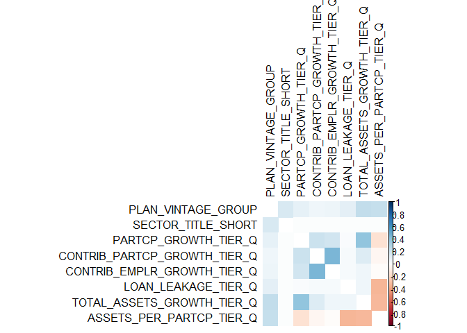
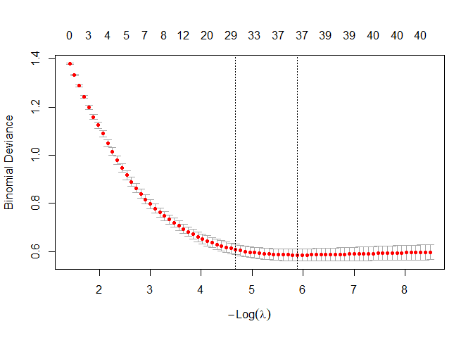

# Pipeline Scope

This notebook encompasses predictor associations, multicollinearity
checks, subset selection, and data splits.

# Load Libraries

This analysis leverages the following R packages: `dplyr` and `forcats`
for data manipulation, `knitr` for report formatting, `ggplot2` and for
visualization, and `caret`, `glmnet`, `pROC` and `randomForest` for
model development.

I use two customized R functions for variable associations and
multicollinearity checks.

# Load Data

Load transformed Form 5500 data.

``` r
plans <- readRDS("../data/plans_transformed.rds")
```

# Check Correlations

Check for correlations among signal predictors.

``` r
predictors <- c("PLAN_VINTAGE_GROUP",
                "SECTOR_TITLE_SHORT",
                "PARTCP_GROWTH_TIER_Q",
                "CONTRIB_PARTCP_GROWTH_TIER_Q",
                "CONTRIB_EMPLR_GROWTH_TIER_Q",
                "LOAN_LEAKAGE_TIER_Q",
                "TOTAL_ASSETS_GROWTH_TIER_Q",
                "ASSETS_PER_PARTCP_TIER_Q")

ordinal_vars <- c("PARTCP_GROWTH_TIER_Q",
                  "CONTRIB_PARTCP_GROWTH_TIER_Q",
                  "CONTRIB_EMPLR_GROWTH_TIER_Q",
                  "LOAN_LEAKAGE_TIER_Q",
                  "TOTAL_ASSETS_GROWTH_TIER_Q",
                  "ASSETS_PER_PARTCP_TIER_Q")

# Run the function to generate correlations summary.

assoc_summary <- test_predictor_associations(plans, predictors, ordinal_vars)
```

    ## 
    ## Attaching package: 'psych'

    ## The following object is masked from 'package:randomForest':
    ## 
    ##     outlier

    ## The following objects are masked from 'package:ggplot2':
    ## 
    ##     %+%, alpha

    ## Loading required package: grid

    ## corrplot 0.95 loaded

<!-- -->

``` r
rownames(assoc_summary) <- NULL

write.csv(assoc_summary, "../outputs/signal_association_summary.csv")
```

## Notable Signal Associations

The strongest observed relationship is between participant and employer
contribution growth tiers (ρ = 0.496), suggesting that when participants
increase their contributions, employers tend to follow suit—an
encouraging sign of synchronized engagement. This dynamic is echoed in
the moderate alignment between participant growth and total asset growth
(ρ = 0.403), reinforcing the idea that expanding participation often
drives overall plan scale.

Vintage stratification shows moderate associations with both total asset
growth (V = 0.258) and assets per participant (V = 0.237), indicating
that older plans may exhibit distinct growth and adequacy profiles.

Several weaker but still informative correlations emerge between growth
tiers and leakage, with loan leakage inversely related to assets per
participant (ρ = -0.298) and total asset growth (ρ = -0.032). These
negative associations may signal structural vulnerabilities in plan
adequacy, especially in high-growth or low-balance environments.

Sector ties to plan vintage and growth tiers are weak (V ≈ 0.012–0.167),
implying that while sector may influence plan characteristics, it does
not dominate growth dynamics—supporting the case for sector-aware but
not sector-deterministic modeling.

The relationship between participant and employer contributions is
structural. The common form of employer contribution is a match, i.e. as
an incentive to employee participation, employers common match deferrals
up to a threshold. So as participant contributions increase, so will
employer matching contributions, subject to an upper limit.

# Multicollinearity

Calculate variance inflation factors to see how much each predictor is
correlated with the others.

``` r
predictors <- c("PLAN_VINTAGE_GROUP",
                "SECTOR_TITLE_SHORT",
                "PARTCP_GROWTH_TIER_Q",
                "CONTRIB_PARTCP_GROWTH_TIER_Q",
                "CONTRIB_EMPLR_GROWTH_TIER_Q",
                "LOAN_LEAKAGE_TIER_Q",
                "TOTAL_ASSETS_GROWTH_TIER_Q",
                "ASSETS_PER_PARTCP_TIER_Q")

vif_summary <- check_multicollinearity_factors(plans, predictors)

rownames(vif_summary) <- NULL

kable(vif_summary, 
      col.names = c("Variable", "VIF"),
      caption = "VIF Summary",
      format.args = list(big.mark = ","),
      align = c("l", "r"))
```

| Variable                          |  VIF |
|:----------------------------------|-----:|
| SECTOR_TITLE_SHORTRetail trade    | 1.91 |
| SECTOR_TITLE_SHORTWholesale trade | 1.91 |
| SECTOR_TITLE_SHORTFinance and …   | 1.90 |
| SECTOR_TITLE_SHORTManufacturing   | 1.90 |
| SECTOR_TITLE_SHORTAccommodatio…   | 1.89 |
| SECTOR_TITLE_SHORTConstruction    | 1.89 |
| SECTOR_TITLE_SHORTTransportati…   | 1.89 |
| SECTOR_TITLE_SHORTOther servic…   | 1.88 |
| SECTOR_TITLE_SHORTReal estate …   | 1.88 |
| SECTOR_TITLE_SHORTAdministrati…   | 1.87 |
| SECTOR_TITLE_SHORTHealth care …   | 1.87 |
| SECTOR_TITLE_SHORTProfessional…   | 1.87 |
| SECTOR_TITLE_SHORTManagement o…   | 1.75 |
| SECTOR_TITLE_SHORTEducational …   | 1.62 |
| SECTOR_TITLE_SHORTArts, entert…   | 1.61 |
| SECTOR_TITLE_SHORTUtilities       | 1.53 |
| TOTAL_ASSETS_GROWTH_TIER_Q.L      | 1.48 |
| ASSETS_PER_PARTCP_TIER_Q.L        | 1.46 |
| PLAN_VINTAGE_GROUP.L              | 1.40 |
| SECTOR_TITLE_SHORTAgriculture,…   | 1.39 |
| SECTOR_TITLE_SHORTMining, quar…   | 1.39 |
| CONTRIB_PARTCP_GROWTH_TIER_Q.L    | 1.33 |
| CONTRIB_EMPLR_GROWTH_TIER_Q.L     | 1.32 |
| PARTCP_GROWTH_TIER_Q.L            | 1.28 |
| CONTRIB_PARTCP_GROWTH_TIER_Q.Q    | 1.23 |
| CONTRIB_EMPLR_GROWTH_TIER_Q.Q     | 1.23 |
| LOAN_LEAKAGE_TIER_Q.L             | 1.17 |
| SECTOR_TITLE_SHORTPublic admin…   | 1.10 |
| PARTCP_GROWTH_TIER_Q.Q            | 1.10 |
| CONTRIB_PARTCP_GROWTH_TIER_Q.C    | 1.09 |
| TOTAL_ASSETS_GROWTH_TIER_Q.Q      | 1.09 |
| PLAN_VINTAGE_GROUP.Q              | 1.08 |
| CONTRIB_EMPLR_GROWTH_TIER_Q.C     | 1.07 |
| LOAN_LEAKAGE_TIER_Q.Q             | 1.05 |
| ASSETS_PER_PARTCP_TIER_Q.Q        | 1.05 |
| PLAN_VINTAGE_GROUP.C              | 1.03 |
| TOTAL_ASSETS_GROWTH_TIER_Q.C      | 1.02 |
| PARTCP_GROWTH_TIER_Q.C            | 1.01 |
| LOAN_LEAKAGE_TIER_Q.C             | 1.01 |
| ASSETS_PER_PARTCP_TIER_Q.C        | 1.01 |

VIF Summary

VIFs across predictors are low with all values below 2.0, indicating
minimal multicollinearity. Sector dummies show slightly higher VIFs of
1.10 to 1.91, which is expected due to categorical encoding. Core
adequacy signals like growth tiers, leakage, and asset levels are low,
supporting stable model interpretability. No immediate concerns for
inflation or redundancy.

# Subset Selection With LASSO

Use LASSO with cross-validation to identify key predictors of plan
adequacy.

``` r
X <- model.matrix(ADEQUACY_IND ~ 
                    PLAN_VINTAGE_GROUP + 
                    SECTOR_TITLE_SHORT + 
                    PARTCP_GROWTH_TIER_Q + 
                    CONTRIB_PARTCP_GROWTH_TIER_Q + 
                    CONTRIB_EMPLR_GROWTH_TIER_Q + 
                    LOAN_LEAKAGE_TIER_Q + 
                    TOTAL_ASSETS_GROWTH_TIER_Q + 
                    ASSETS_PER_PARTCP_TIER_Q, 
                  data = plans)

y <- as.numeric(plans$ADEQUACY_IND) - 1

lasso_model <- cv.glmnet(X, y, alpha = 1, family = "binomial")
```

Check the cross-validation curve.

``` r
plot(lasso_model)
```

<!-- -->

This cross-validation curve shows how model performance varies with the
LASSO penalty parameter, $`\lambda`$. As $`\lambda`$ decreases (moving
right), binomial deviance drops sharply, then plateaus, indicating
diminishing returns from adding more predictors.

The left dashed line ($`\lambda_{min}`$) marks the model with the lowest
cross-validation error, offering the best predictive fit.

The right dashed line ($`\lambda_{1se}`$) represents a simpler model
with slightly higher error but far fewer predictors, still within one
standard error of the minimum.

As regularization weakens, the model becomes more flexible, but also
more sensitive to noise. This increased sensitivity leads to greater
variability across folds, reflected in the widening error bars. That’s
why we favor the more regularized region near
$`-log(\lambda) \approx 5`$, where deviance is low and performance is
more stable.

In practice $`\lambda_{min}`$ is chosen for maximum accuracy.
$`\lambda_{1se}`$ is preferred for interpretability and parsimony. For
this analysis, I’ll proceed with $`\lambda_{min}`$.

Extract selected predictors.

``` r
# Extract coefficients at best lambda.

coef_matrix <- coef(lasso_model, s = "lambda.min")

# Convert to data frame and filter non-zero coefficients.

selected_predictors <- as.data.frame(as.matrix(coef_matrix)) %>%
  rename(estimate = 1) %>%
  mutate(term = rownames(coef_matrix)) %>%
  # filter(estimate != 0) %>%
  arrange(desc(abs(estimate)))

rownames(selected_predictors) <- NULL

# Preview selected predictors; table summary.

kable(selected_predictors,
      col.names = c("Estimate", "Term"),
      caption = "Selected Predictors",
      format.args = list(big.mark = ","),
      align = c("l", "l"))
```

| Estimate   | Term                              |
|:-----------|:----------------------------------|
| 2.8614552  | PARTCP_GROWTH_TIER_Q.L            |
| 2.6771184  | CONTRIB_PARTCP_GROWTH_TIER_Q.L    |
| 2.5079349  | CONTRIB_EMPLR_GROWTH_TIER_Q.L     |
| -2.3985073 | LOAN_LEAKAGE_TIER_Q.L             |
| 2.2827429  | ASSETS_PER_PARTCP_TIER_Q.L        |
| -2.2592249 | SECTOR_TITLE_SHORTPublic admin…   |
| -1.4018416 | SECTOR_TITLE_SHORTManufacturing   |
| -1.3538567 | SECTOR_TITLE_SHORTAccommodatio…   |
| 1.0586490  | SECTOR_TITLE_SHORTHealth care …   |
| 1.0224775  | SECTOR_TITLE_SHORTProfessional…   |
| 1.0084811  | SECTOR_TITLE_SHORTArts, entert…   |
| -1.0004966 | SECTOR_TITLE_SHORTRetail trade    |
| 0.9457871  | SECTOR_TITLE_SHORTEducational …   |
| -0.9341741 | CONTRIB_EMPLR_GROWTH_TIER_Q.C     |
| 0.8870891  | SECTOR_TITLE_SHORTMining, quar…   |
| -0.8730260 | SECTOR_TITLE_SHORTTransportati…   |
| 0.7754975  | TOTAL_ASSETS_GROWTH_TIER_Q.L      |
| 0.7217047  | SECTOR_TITLE_SHORTConstruction    |
| -0.5579932 | SECTOR_TITLE_SHORTAgriculture,…   |
| 0.5359233  | SECTOR_TITLE_SHORTWholesale trade |
| -0.5263909 | PARTCP_GROWTH_TIER_Q.C            |
| -0.4981689 | CONTRIB_PARTCP_GROWTH_TIER_Q.C    |
| 0.4560205  | SECTOR_TITLE_SHORTManagement o…   |
| 0.4483328  | ASSETS_PER_PARTCP_TIER_Q.Q        |
| -0.4118440 | CONTRIB_EMPLR_GROWTH_TIER_Q.Q     |
| -0.4070555 | SECTOR_TITLE_SHORTUtilities       |
| -0.4018628 | SECTOR_TITLE_SHORTAdministrati…   |
| -0.3735922 | PLAN_VINTAGE_GROUP.Q              |
| 0.3538258  | SECTOR_TITLE_SHORTOther servic…   |
| -0.3189513 | TOTAL_ASSETS_GROWTH_TIER_Q.Q      |
| -0.2585841 | (Intercept)                       |
| -0.2460970 | ASSETS_PER_PARTCP_TIER_Q.C        |
| 0.2122074  | LOAN_LEAKAGE_TIER_Q.C             |
| -0.1968031 | PARTCP_GROWTH_TIER_Q.Q            |
| 0.1773524  | PLAN_VINTAGE_GROUP.C              |
| -0.0953494 | CONTRIB_PARTCP_GROWTH_TIER_Q.Q    |
| -0.0285039 | TOTAL_ASSETS_GROWTH_TIER_Q.C      |
| 0.0204957  | LOAN_LEAKAGE_TIER_Q.Q             |
| 0.0000000  | (Intercept)                       |
| 0.0000000  | PLAN_VINTAGE_GROUP.L              |
| 0.0000000  | SECTOR_TITLE_SHORTFinance and …   |
| 0.0000000  | SECTOR_TITLE_SHORTReal estate …   |

Selected Predictors

Store original sector levels for comparison.

``` r
original_levels <- levels(plans$SECTOR_TITLE_SHORT)
```

Filter out sector levels that LASSO shrunk to zero. Keeps only the
levels that contributed meaningfully to adequacy prediction.

``` r
# Extract non-zero coefficients from lasso.

coef_lasso <- coef(lasso_model, s = "lambda.min")

nonzero_terms <- rownames(coef_lasso)[which(coef_lasso != 0)]

# Identify retained sector levels.

sector_terms <- grep("^SECTOR_TITLE_SHORT", nonzero_terms, value = TRUE)

retained_levels <- gsub("^SECTOR_TITLE_SHORT", "", sector_terms)

# Clean up factor levels in the dataset.

plans$SECTOR_TITLE_SHORT <- fct_other(plans$SECTOR_TITLE_SHORT, keep = retained_levels, other_level = "Other")

# plans$SECTOR_TITLE_SHORT <- factor(plans$SECTOR_TITLE_SHORT, levels = retained_levels)
```

Compare original and dropped levels; confirm the levels that were
removed.

``` r
# Show which levels were removed.

setdiff(original_levels, levels(plans$SECTOR_TITLE_SHORT))
```

    ## [1] "Information"     "Finance and ..." "Real estate ..."

# Split Data

Split the dataset into training (70%), validation (15%), and test (15%)
sets to support model development, tuning, and final evaluation. This
yields approximately:

- Training: 1,165 observations,
- Validation: 250 observations, and
- Test: 250 observations.

With 1,665 total observations, a 70/15/15 split is generally
appropriate. Each subset remains large enough to support stable
estimation and diagnostic review.

``` r
# Initial train/test split.

train_idx <- createDataPartition(plans$ADEQUACY_IND, p = 0.7, list = FALSE)

plans_train <- plans[train_idx, ]

temp  <- plans[-train_idx, ]

# Split remaining into validation/test.

valid_idx <- createDataPartition(temp$ADEQUACY_IND, p = 0.5, list = FALSE)

plans_validate <- temp[valid_idx, ]

plans_test <- temp[-valid_idx, ]
```

Check class balance in the train, validation and test sets.

``` r
# Check balance function.

check_balance <- function(df, name) {
  df %>%
    count(ADEQUACY_IND) %>%
    mutate(prop = round(n / sum(n), 2),
           dataset = name) %>%
    select(dataset,
           ADEQUACY_IND, 
           n,
           prop)
}

# Generate data frame.

check_split <- bind_rows(check_balance(plans_train, "Train"),
                   check_balance(plans_validate, "Validation"),
                   check_balance(plans_test, "Test"))

saveRDS(check_split, "../data/data_splits.rds")

# Produce table summary.

kable(check_split,
      col.names = c("Dataset", "Adequacy Level", "Count", "Percent"),
      caption = "Dataset Class Balance",
      format.args = list(big.mark = ","),
      align = c("l", "r", "r", "r"))
```

| Dataset    | Adequacy Level | Count | Percent |
|:-----------|---------------:|------:|--------:|
| Train      |              0 |   615 |    0.53 |
| Train      |              1 |   551 |    0.47 |
| Validation |              0 |   132 |    0.53 |
| Validation |              1 |   118 |    0.47 |
| Test       |              0 |   131 |    0.53 |
| Test       |              1 |   118 |    0.47 |

Dataset Class Balance

The 70/15/15 split maintains a reasonably balanced adequacy class
distribution across all subsets. The splits retain the slightly higher
proportion for the inadequate class.

# Save Data

``` r
saveRDS(plans_train, "../data/plans_train.rds")

saveRDS(plans_validate, "../data/plans_validate.rds")

saveRDS(plans_test, "../data/plans_test.rds")
```

# Next Step

Train and validate models.
