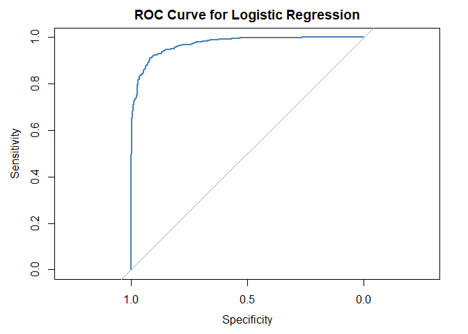
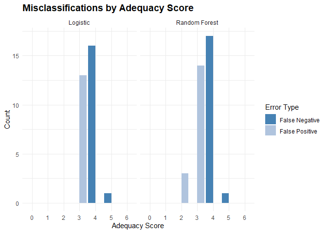

# Pipeline Scope

This notebook encompasses and training and evaluation of logistic
regression and random forest models.

# Load Libraries

This analysis leverages the following R packages: `dplyr`, `lubridate`,
’`stringr` and `tidyr` for data manipulation, `knitr` for report
formatting, and `ggplot2` and `ggridges` for visualization.

I use a customized R function to collect performance metrics across
model runs.

# Load Data

Load training, validation and test sets.

``` r
plans_train <- readRDS("../data/plans_train.rds")

plans_validate <- readRDS("../data/plans_validate.rds")

plans_test <- readRDS("../data/plans_test.rds")
```

# Train Models

## Logistic Regression Model

Produce logistic model and summary output.

``` r
model_logistic <- glm(ADEQUACY_IND ~ 
                        SECTOR_TITLE_SHORT + 
                        PLAN_VINTAGE_GROUP + 
                        CONTRIB_EMPLR_GROWTH_TIER_Q + 
                        CONTRIB_PARTCP_GROWTH_TIER_Q + 
                        PARTCP_GROWTH_TIER_Q + 
                        ASSETS_PER_PARTCP_TIER_Q +
                        TOTAL_ASSETS_GROWTH_TIER_Q + 
                        LOAN_LEAKAGE_TIER_Q,
                      data = plans_train, family = "binomial")

summary(model_logistic)
```

    ## 
    ## Call:
    ## glm(formula = ADEQUACY_IND ~ SECTOR_TITLE_SHORT + PLAN_VINTAGE_GROUP + 
    ##     CONTRIB_EMPLR_GROWTH_TIER_Q + CONTRIB_PARTCP_GROWTH_TIER_Q + 
    ##     PARTCP_GROWTH_TIER_Q + ASSETS_PER_PARTCP_TIER_Q + TOTAL_ASSETS_GROWTH_TIER_Q + 
    ##     LOAN_LEAKAGE_TIER_Q, family = "binomial", data = plans_train)
    ## 
    ## Coefficients:
    ##                                    Estimate Std. Error z value Pr(>|z|)    
    ## (Intercept)                        -0.94807    0.44747  -2.119 0.034115 *  
    ## SECTOR_TITLE_SHORTAdministrati...  -0.62169    0.66754  -0.931 0.351691    
    ## SECTOR_TITLE_SHORTAgriculture,...  -0.49015    0.82153  -0.597 0.550757    
    ## SECTOR_TITLE_SHORTArts, entert...   1.78989    0.71798   2.493 0.012669 *  
    ## SECTOR_TITLE_SHORTEducational ...   2.03610    0.67686   3.008 0.002628 ** 
    ## SECTOR_TITLE_SHORTFinance and ...   1.16204    0.63783   1.822 0.068477 .  
    ## SECTOR_TITLE_SHORTHealth care ...   1.12040    0.66960   1.673 0.094282 .  
    ## SECTOR_TITLE_SHORTManagement o...   0.83619    0.67103   1.246 0.212721    
    ## SECTOR_TITLE_SHORTManufacturing    -0.23856    0.67350  -0.354 0.723183    
    ## SECTOR_TITLE_SHORTMining, quar...   2.87838    0.93604   3.075 0.002105 ** 
    ## SECTOR_TITLE_SHORTProfessional...   1.76129    0.64746   2.720 0.006522 ** 
    ## SECTOR_TITLE_SHORTPublic admin... -19.07158  759.81769  -0.025 0.979975    
    ## SECTOR_TITLE_SHORTRetail trade     -0.95391    0.65486  -1.457 0.145211    
    ## SECTOR_TITLE_SHORTTransportati...  -1.11010    0.69026  -1.608 0.107786    
    ## SECTOR_TITLE_SHORTUtilities         0.07155    0.78010   0.092 0.926926    
    ## SECTOR_TITLE_SHORTWholesale trade  -0.12764    0.65020  -0.196 0.844370    
    ## SECTOR_TITLE_SHORTOther             0.94170    0.50240   1.874 0.060875 .  
    ## PLAN_VINTAGE_GROUP.L               -0.08687    0.28578  -0.304 0.761153    
    ## PLAN_VINTAGE_GROUP.Q               -0.54308    0.24108  -2.253 0.024276 *  
    ## PLAN_VINTAGE_GROUP.C                0.10487    0.23128   0.453 0.650234    
    ## CONTRIB_EMPLR_GROWTH_TIER_Q.L       3.43298    0.31967  10.739  < 2e-16 ***
    ## CONTRIB_EMPLR_GROWTH_TIER_Q.Q      -0.55526    0.25615  -2.168 0.030180 *  
    ## CONTRIB_EMPLR_GROWTH_TIER_Q.C      -1.45784    0.24210  -6.022 1.73e-09 ***
    ## CONTRIB_PARTCP_GROWTH_TIER_Q.L      3.37590    0.30858  10.940  < 2e-16 ***
    ## CONTRIB_PARTCP_GROWTH_TIER_Q.Q     -0.13078    0.26118  -0.501 0.616570    
    ## CONTRIB_PARTCP_GROWTH_TIER_Q.C     -1.18215    0.23056  -5.127 2.94e-07 ***
    ## PARTCP_GROWTH_TIER_Q.L              3.82063    0.33326  11.465  < 2e-16 ***
    ## PARTCP_GROWTH_TIER_Q.Q             -0.47614    0.24566  -1.938 0.052597 .  
    ## PARTCP_GROWTH_TIER_Q.C             -0.75243    0.22360  -3.365 0.000765 ***
    ## ASSETS_PER_PARTCP_TIER_Q.L          3.38099    0.35774   9.451  < 2e-16 ***
    ## ASSETS_PER_PARTCP_TIER_Q.Q          0.50865    0.23836   2.134 0.032845 *  
    ## ASSETS_PER_PARTCP_TIER_Q.C         -0.97624    0.24183  -4.037 5.42e-05 ***
    ## TOTAL_ASSETS_GROWTH_TIER_Q.L        0.86159    0.28298   3.045 0.002330 ** 
    ## TOTAL_ASSETS_GROWTH_TIER_Q.Q       -0.31539    0.24577  -1.283 0.199403    
    ## TOTAL_ASSETS_GROWTH_TIER_Q.C        0.15503    0.22968   0.675 0.499687    
    ## LOAN_LEAKAGE_TIER_Q.L              -2.94462    0.30343  -9.705  < 2e-16 ***
    ## LOAN_LEAKAGE_TIER_Q.Q               0.04130    0.23422   0.176 0.860028    
    ## LOAN_LEAKAGE_TIER_Q.C               0.24491    0.23539   1.040 0.298126    
    ## ---
    ## Signif. codes:  0 '***' 0.001 '**' 0.01 '*' 0.05 '.' 0.1 ' ' 1
    ## 
    ## (Dispersion parameter for binomial family taken to be 1)
    ## 
    ##     Null deviance: 1613.33  on 1165  degrees of freedom
    ## Residual deviance:  515.75  on 1128  degrees of freedom
    ## AIC: 591.75
    ## 
    ## Number of Fisher Scoring iterations: 15

Regarding coefficients with high p-values, this model was selected for
predictive performance, not hypothesis testing. Some coefficients may
not be statistically significant on their own, but they contribute to
the model’s overall fit and help stabilize other effects. LASSO has
already filtered out irrelevant predictors, so what remains reflects a
balance of parsimony and predictive utility.

Plot residuals.

``` r
resid_df <- data.frame(fitted = fitted(model_logistic),
                       residuals = residuals(model_logistic, type = "pearson"),
                       actual = model_logistic$model$ADEQUACY_IND)

# Convert actual outcome to factor for faceting.

resid_df$class <- factor(resid_df$actual, levels = c(0, 1), labels = c("Class 0", "Class 1"))

# Plot residuals vs. fitted by class.

ggplot(resid_df, aes(x = fitted, y = residuals)) +
  geom_point(alpha = 0.3, color = "blue") +
  geom_smooth(method = "loess", se = TRUE, color = "blue", linewidth = 0.8) +
  # facet_wrap(~ class) +
  geom_hline(yintercept = 0, linetype = "dashed") +
  labs(title = "Residuals vs Fitted by Class",
       x = "Fitted Values",
       y = "Pearson Residuals") +
  theme_minimal()
```

    ## `geom_smooth()` using formula = 'y ~ x'

<!-- -->

The Pearson residual plot shows a mild curved pattern. This suggests
some systematic deviation from model assumptions, possibly due to
unmodeled nonlinearity or missing interactions. The residual variance is
larger at the extremes (fitted values near 0 or 1), which is partly
expected in logistic regression due to the changing variance structure
of the binomial model. A few high residual points indicate potential
outliers or influential observations.

Overall, the plot suggests the model captures the main relationship
between predictors and the outcome, but may not fully account for all
effects, leaving room for refinement.

Show binned residuals.

``` r
arm::binnedplot(x = fitted(model_logistic),
         y = residuals(model_logistic, type = "response"),
         xlab = "Fitted Probabilities",
         ylab = "Average Residuals",
         main = "Binned Residual Plot")
```

<!-- -->

The binned residual plot displays average residuals across bins of
fitted probabilities, along with 95% simulation envelopes. Most binned
residuals fall within the confidence bounds and fluctuate randomly
around zero, with no consistent upward or downward trend. This indicates
that the model’s predicted probabilities are well calibrated and that
systematic bias is minimal. Minor deviations appear in the midrange
probabilities (around 0.2–0.4), but they are small and within acceptable
limits.

Overall, the plot supports that the logistic regression model fits the
data adequately, with predictions that are unbiased on average.

Predict class scores on the training set.

``` r
# Extract the model's training data.

model_data <- model_logistic$model

# Generate predicted probabilities.

model_data$predicted_prob <- predict(model_logistic, type = "response")

# Classify based on threshold.

model_data$predicted_class <- ifelse(model_data$predicted_prob > 0.5, 1, 0)

# Confusion matrix.

cm_logistic_train <- confusionMatrix(factor(model_data$predicted_class),
                                     factor(model_data$ADEQUACY_IND))

# Add logistic train metrics to metrics data frame.

df_all_metrics <- add_metrics_row(cm_logistic_train, "Logistic", "Train", df_all_metrics)

cm_logistic_train
```

    ## Confusion Matrix and Statistics
    ## 
    ##           Reference
    ## Prediction   0   1
    ##          0 564  55
    ##          1  49 498
    ##                                          
    ##                Accuracy : 0.9108         
    ##                  95% CI : (0.893, 0.9265)
    ##     No Information Rate : 0.5257         
    ##     P-Value [Acc > NIR] : <2e-16         
    ##                                          
    ##                   Kappa : 0.821          
    ##                                          
    ##  Mcnemar's Test P-Value : 0.6239         
    ##                                          
    ##             Sensitivity : 0.9201         
    ##             Specificity : 0.9005         
    ##          Pos Pred Value : 0.9111         
    ##          Neg Pred Value : 0.9104         
    ##              Prevalence : 0.5257         
    ##          Detection Rate : 0.4837         
    ##    Detection Prevalence : 0.5309         
    ##       Balanced Accuracy : 0.9103         
    ##                                          
    ##        'Positive' Class : 0              
    ## 

The logistic regression model demonstrates strong, well-balanced
classification performance. Accuracy (~89%) and kappa (~0.78) indicate
robust predictive ability with minimal bias between classes. Sensitivity
and specificity are both high and nearly equal, confirming the model
distinguishes classes effectively. The non-significant McNemar’s test
further supports that the model’s errors are symmetric. Overall, this is
a well-calibrated, reliable classifier with room for only minor tuning.

Generate ROC.

``` r
# Compute ROC curve
roc_obj_log <- pROC::roc(model_data$ADEQUACY_IND, model_data$predicted_prob)
```

    ## Setting levels: control = 0, case = 1

    ## Setting direction: controls < cases

``` r
# Plot ROC
plot(roc_obj_log, col = "steelblue", main = "ROC Curve for Logistic Regression")
```

<!-- -->

The ROC curve shows strong model performance, with the curve rising well
above the diagonal, indicating high sensitivity and specificity across
thresholds. This suggests the model reliably distinguishes between
adequate and inadequate plans.

Generate model AUC.

``` r
pROC::auc(roc_obj_log)
```

    ## Area under the curve: 0.9701

An AUC of 0.9633 indicates excellent model performance. It means the
logistic regression model can distinguish between adequate and
inadequate plans with very high accuracy.

## Random Forest Model

Generate random forest model and show model performance.

``` r
# plans_train$ADEQUACY_IND <- as.factor(plans_train$ADEQUACY_IND)

model_rf <- randomForest(ADEQUACY_IND ~ 
                           CONTRIB_EMPLR_GROWTH_TIER_Q + 
                           CONTRIB_PARTCP_GROWTH_TIER_Q +
                           PARTCP_GROWTH_TIER_Q + 
                           ASSETS_PER_PARTCP_TIER_Q + 
                           TOTAL_ASSETS_GROWTH_TIER_Q +
                           LOAN_LEAKAGE_TIER_Q,
                         data = plans_train,
                         ntree = 500,
                         mtry = 3,
                         importance = TRUE)

print(model_rf)
```

    ## 
    ## Call:
    ##  randomForest(formula = ADEQUACY_IND ~ CONTRIB_EMPLR_GROWTH_TIER_Q +      CONTRIB_PARTCP_GROWTH_TIER_Q + PARTCP_GROWTH_TIER_Q + ASSETS_PER_PARTCP_TIER_Q +      TOTAL_ASSETS_GROWTH_TIER_Q + LOAN_LEAKAGE_TIER_Q, data = plans_train,      ntree = 500, mtry = 3, importance = TRUE) 
    ##                Type of random forest: classification
    ##                      Number of trees: 500
    ## No. of variables tried at each split: 3
    ## 
    ##         OOB estimate of  error rate: 14.67%
    ## Confusion matrix:
    ##     0   1 class.error
    ## 0 530  83   0.1353997
    ## 1  88 465   0.1591320

The random forest achieves strong and balanced classification accuracy
(~84%) with no major class bias. It performs slightly below the logistic
model’s 89% accuracy but benefits from flexibility and robustness to
nonlinearity. Both models perform well; the choice depends on whether
interpretability or pure predictive strength is the priority.

Generate a variable importance plot.

``` r
varImpPlot(model_rf, type = 2, main = "Random Forest Variable Importance")
```

<!-- -->

The random forest model confirms that contribution growth, especially
participant-driven growth, is the strongest predictor of plan adequacy,
followed closely by employer contributions and loan leakage. This
resonates as industry studies confirm that those who contribute
consistently to retirement savings - and do not draw early on savings -
are generally more financially prepared for this life event.

Asset-based tiers play a supporting role, while total asset growth shows
the least influence.

Generate prediction on training data and confusion matrix.

``` r
# Filter training data to match model input.

vars_used <- all.vars(formula(model_rf))

plans_train_rf <- na.omit(plans_train[, vars_used])

# Generate predictions.

rf_preds <- predict(model_rf, newdata = plans_train_rf, type = "response")

# Confusion matrix.

cm_rf_train <- confusionMatrix(rf_preds, plans_train_rf$ADEQUACY_IND, positive = "0")

df_all_metrics <- add_metrics_row(cm_rf_train, "RandomForest", "Train", df_all_metrics)

cm_rf_train
```

    ## Confusion Matrix and Statistics
    ## 
    ##           Reference
    ## Prediction   0   1
    ##          0 598  25
    ##          1  15 528
    ##                                           
    ##                Accuracy : 0.9657          
    ##                  95% CI : (0.9536, 0.9754)
    ##     No Information Rate : 0.5257          
    ##     P-Value [Acc > NIR] : <2e-16          
    ##                                           
    ##                   Kappa : 0.9311          
    ##                                           
    ##  Mcnemar's Test P-Value : 0.1547          
    ##                                           
    ##             Sensitivity : 0.9755          
    ##             Specificity : 0.9548          
    ##          Pos Pred Value : 0.9599          
    ##          Neg Pred Value : 0.9724          
    ##              Prevalence : 0.5257          
    ##          Detection Rate : 0.5129          
    ##    Detection Prevalence : 0.5343          
    ##       Balanced Accuracy : 0.9652          
    ##                                           
    ##        'Positive' Class : 0               
    ## 

The random forest’s 96.7% test accuracy is unusually high relative to
its 84% OOB accuracy, suggesting possible data leakage, overlap, or
overly optimistic test sampling. I’ll verify performance with validation
and test sets.

Generate ROC.

``` r
# Generate predicted probabilities for Class 0.

rf_probs <- predict(model_rf, newdata = plans_train_rf, type = "prob")[, "0"]

# Compute ROC using actuals and probabilities.

roc_obj <- pROC::roc(plans_train_rf$ADEQUACY_IND, rf_probs, levels = c("1", "0"), direction = "<")

# Plot ROC curve.

plot(roc_obj, col = "steelblue", main = "Random Forest ROC Curve")
```

<!-- -->

When combined with the 96.7% test accuracy and 84% OOB accuracy, this
near-perfect ROC curve reinforces that the model may be over-fitting the
training data.

Generate model AUC.

``` r
auc(roc_obj)
```

    ## Area under the curve: 0.9958

This AUC is signaling near-perfect discrimination, better than nearly
all real-world models built on behavioral or operational data. Need to
check with validation data.

## Performance Metric Comparison

Show performance metric comparison for both models with training data.

``` r
kable(df_all_metrics,
      col.names = c("Metric", names(df_all_metrics)[-1]),
      caption = "Model Performance Comparison (Wide Format)",
      format.args = list(big.mark = ","),
      align = c("l", rep("r", ncol(df_all_metrics) - 1)))
```

| Metric            | Logistic_Train | RandomForest_Train |
|:------------------|---------------:|-------------------:|
| Accuracy          |         0.9108 |             0.9657 |
| Balanced Accuracy |         0.9103 |             0.9652 |
| Kappa             |         0.8210 |             0.9311 |
| McnemarPValue     |         0.6239 |             0.1547 |
| Neg Pred Value    |         0.9104 |             0.9724 |
| Pos Pred Value    |         0.9111 |             0.9599 |
| Sensitivity       |         0.9201 |             0.9755 |
| Specificity       |         0.9005 |             0.9548 |

Model Performance Comparison (Wide Format)

Random Forest may be overfitting on the training data, given its
near-perfect scores. Logistic regression, while less precise, may offer
better generalization and interpretability, especially if validation and
test metrics show random forest performance dropping.

# Validate Models

Validate models with validation data.

## Logistic Regression Model

Predict outcomes with the validation data.

``` r
pred_probs_logistic <- predict(model_logistic, newdata = plans_validate, type = "response")

class_pred_logistic <- ifelse(pred_probs_logistic >= 0.5, 1, 0)

cm_logistic_validate <- caret::confusionMatrix(factor(class_pred_logistic),
                                            factor(plans_validate$ADEQUACY_IND))

# Capture performance metrics.

df_all_metrics <- add_metrics_row(cm_logistic_validate, "Logistic", "Validate", df_all_metrics)

cm_logistic_validate
```

    ## Confusion Matrix and Statistics
    ## 
    ##           Reference
    ## Prediction   0   1
    ##          0 116  18
    ##          1  15 101
    ##                                           
    ##                Accuracy : 0.868           
    ##                  95% CI : (0.8196, 0.9074)
    ##     No Information Rate : 0.524           
    ##     P-Value [Acc > NIR] : <2e-16          
    ##                                           
    ##                   Kappa : 0.7351          
    ##                                           
    ##  Mcnemar's Test P-Value : 0.7277          
    ##                                           
    ##             Sensitivity : 0.8855          
    ##             Specificity : 0.8487          
    ##          Pos Pred Value : 0.8657          
    ##          Neg Pred Value : 0.8707          
    ##              Prevalence : 0.5240          
    ##          Detection Rate : 0.4640          
    ##    Detection Prevalence : 0.5360          
    ##       Balanced Accuracy : 0.8671          
    ##                                           
    ##        'Positive' Class : 0               
    ## 

Based on these metrics, the logistic model generalizes well. The slight
drop in specificity on the validation set (compared to the metrics for
the training set), paired with a significant McNemar result, hints at a
modest skew toward false positives, i.e. adequate plans mis-classified
as inadequate. The model is accurate overall, but the error distribution
isn’t balanced. This contrasts with the training set McNemar result
(0.5791), which showed no directional bias.

## Random Forest Model

``` r
rf_preds <- predict(model_rf, newdata = plans_validate, type = "response")

# table(Predicted = rf_preds, Actual = plans_validate$ADEQUACY_IND)

cm_rf_validate <- confusionMatrix(rf_preds, plans_validate$ADEQUACY_IND, positive = "0")

# Capture performance metrics.

df_all_metrics <- add_metrics_row(cm_rf_validate, "RandomForest", "Validate", df_all_metrics)

cm_rf_validate
```

    ## Confusion Matrix and Statistics
    ## 
    ##           Reference
    ## Prediction   0   1
    ##          0 109  21
    ##          1  22  98
    ##                                           
    ##                Accuracy : 0.828           
    ##                  95% CI : (0.7754, 0.8726)
    ##     No Information Rate : 0.524           
    ##     P-Value [Acc > NIR] : <2e-16          
    ##                                           
    ##                   Kappa : 0.6553          
    ##                                           
    ##  Mcnemar's Test P-Value : 1               
    ##                                           
    ##             Sensitivity : 0.8321          
    ##             Specificity : 0.8235          
    ##          Pos Pred Value : 0.8385          
    ##          Neg Pred Value : 0.8167          
    ##              Prevalence : 0.5240          
    ##          Detection Rate : 0.4360          
    ##    Detection Prevalence : 0.5200          
    ##       Balanced Accuracy : 0.8278          
    ##                                           
    ##        'Positive' Class : 0               
    ## 

## Performance Metric Comparison

Show performance metric comparison for models with training and
validation runs.

``` r
kable(df_all_metrics,
      col.names = c("Metric", names(df_all_metrics)[-1]),
      caption = "Model Performance Comparison (Wide Format)",
      format.args = list(big.mark = ","),
      align = c("l", rep("r", ncol(df_all_metrics) - 1)))
```

| Metric | Logistic_Train | RandomForest_Train | Logistic_Validate | RandomForest_Validate |
|:---|---:|---:|---:|---:|
| Accuracy | 0.9108 | 0.9657 | 0.8680 | 0.8280 |
| Balanced Accuracy | 0.9103 | 0.9652 | 0.8671 | 0.8278 |
| Kappa | 0.8210 | 0.9311 | 0.7351 | 0.6553 |
| McnemarPValue | 0.6239 | 0.1547 | 0.7277 | 1.0000 |
| Neg Pred Value | 0.9104 | 0.9724 | 0.8707 | 0.8167 |
| Pos Pred Value | 0.9111 | 0.9599 | 0.8657 | 0.8385 |
| Sensitivity | 0.9201 | 0.9755 | 0.8855 | 0.8321 |
| Specificity | 0.9005 | 0.9548 | 0.8487 | 0.8235 |

Model Performance Comparison (Wide Format)

# Test Models

## Logistic Regression Model

``` r
pred_probs_logistic <- predict(model_logistic, newdata = plans_test, type = "response")

class_pred_logistic <- ifelse(pred_probs_logistic >= 0.5, 1, 0)

cm_logistic_test <- caret::confusionMatrix(factor(class_pred_logistic),
                                            factor(plans_test$ADEQUACY_IND))

# Capture performance metrics.

df_all_metrics <- add_metrics_row(cm_logistic_test, "Logistic", "Test", df_all_metrics)

cm_logistic_test
```

    ## Confusion Matrix and Statistics
    ## 
    ##           Reference
    ## Prediction   0   1
    ##          0 118  17
    ##          1  13 101
    ##                                           
    ##                Accuracy : 0.8795          
    ##                  95% CI : (0.8325, 0.9172)
    ##     No Information Rate : 0.5261          
    ##     P-Value [Acc > NIR] : <2e-16          
    ##                                           
    ##                   Kappa : 0.758           
    ##                                           
    ##  Mcnemar's Test P-Value : 0.5839          
    ##                                           
    ##             Sensitivity : 0.9008          
    ##             Specificity : 0.8559          
    ##          Pos Pred Value : 0.8741          
    ##          Neg Pred Value : 0.8860          
    ##              Prevalence : 0.5261          
    ##          Detection Rate : 0.4739          
    ##    Detection Prevalence : 0.5422          
    ##       Balanced Accuracy : 0.8783          
    ##                                           
    ##        'Positive' Class : 0               
    ## 

## Random Forest Model

``` r
rf_preds <- predict(model_rf, newdata = plans_test, type = "response")

# table(Predicted = rf_preds, Actual = plans_validate$ADEQUACY_IND)

cm_rf_test <- confusionMatrix(rf_preds, plans_test$ADEQUACY_IND, positive = "0")

# Capture performance metrics.

df_all_metrics <- add_metrics_row(cm_rf_test, "RandomForest", "Test", df_all_metrics)

cm_rf_test
```

    ## Confusion Matrix and Statistics
    ## 
    ##           Reference
    ## Prediction   0   1
    ##          0 114  18
    ##          1  17 100
    ##                                         
    ##                Accuracy : 0.8594        
    ##                  95% CI : (0.81, 0.9001)
    ##     No Information Rate : 0.5261        
    ##     P-Value [Acc > NIR] : <2e-16        
    ##                                         
    ##                   Kappa : 0.718         
    ##                                         
    ##  Mcnemar's Test P-Value : 1             
    ##                                         
    ##             Sensitivity : 0.8702        
    ##             Specificity : 0.8475        
    ##          Pos Pred Value : 0.8636        
    ##          Neg Pred Value : 0.8547        
    ##              Prevalence : 0.5261        
    ##          Detection Rate : 0.4578        
    ##    Detection Prevalence : 0.5301        
    ##       Balanced Accuracy : 0.8588        
    ##                                         
    ##        'Positive' Class : 0             
    ## 

# Final Comparison

## Performance Metric Comparison

Show performance metric comparison for models with training and
validation runs.

``` r
kable(df_all_metrics,
      col.names = c("Metric", names(df_all_metrics)[-1]),
      caption = "Model Performance Comparison (Wide Format)",
      format.args = list(big.mark = ","),
      align = c("l", rep("r", ncol(df_all_metrics) - 1)))
```

| Metric | Logistic_Train | RandomForest_Train | Logistic_Validate | RandomForest_Validate | Logistic_Test | RandomForest_Test |
|:---|---:|---:|---:|---:|---:|---:|
| Accuracy | 0.9108 | 0.9657 | 0.8680 | 0.8280 | 0.8795 | 0.8594 |
| Balanced Accuracy | 0.9103 | 0.9652 | 0.8671 | 0.8278 | 0.8783 | 0.8588 |
| Kappa | 0.8210 | 0.9311 | 0.7351 | 0.6553 | 0.7580 | 0.7180 |
| McnemarPValue | 0.6239 | 0.1547 | 0.7277 | 1.0000 | 0.5839 | 1.0000 |
| Neg Pred Value | 0.9104 | 0.9724 | 0.8707 | 0.8167 | 0.8860 | 0.8547 |
| Pos Pred Value | 0.9111 | 0.9599 | 0.8657 | 0.8385 | 0.8741 | 0.8636 |
| Sensitivity | 0.9201 | 0.9755 | 0.8855 | 0.8321 | 0.9008 | 0.8702 |
| Specificity | 0.9005 | 0.9548 | 0.8487 | 0.8235 | 0.8559 | 0.8475 |

Model Performance Comparison (Wide Format)

``` r
saveRDS(df_all_metrics, "../data/model_metrics.rds")
```

# Misclassification Analysis

To assess whether the models were simply reproducing the engineered
adequacy score, I conducted a misclassification analysis across adequacy
tiers using the unseen test data. Both the logistic regression and
random forest models showed clear signs of structural learning.

Tag misclassified plans with flags for false positives and false
negatives using the test set.

``` r
plans_test <- plans_test %>%
  mutate(ADEQUACY_IND_NUM = as.numeric(as.character(ADEQUACY_IND)),
         LOGISTIC_PRED_NUM = as.numeric(as.character(class_pred_logistic)),
         RF_PRED_NUM = as.numeric(as.character(rf_preds))) %>%
  mutate(LOGISTIC_FP = LOGISTIC_PRED_NUM == 1 & ADEQUACY_IND_NUM == 0,
         LOGISTIC_FN = LOGISTIC_PRED_NUM == 0 & ADEQUACY_IND_NUM == 1,
         RF_FP = RF_PRED_NUM == 1 & ADEQUACY_IND_NUM == 0,
         RF_FN = RF_PRED_NUM == 0 & ADEQUACY_IND_NUM == 1)
```

Summarize misclassifications by adequacy score to show whether
misclassified plans are near the threshold (e.g., score of 3 or 4).

``` r
class_check <- plans_test %>%
  group_by(ADEQUACY_SCORE) %>%
  summarise(
    Logistic_FN = sum(LOGISTIC_FN),
    Logistic_FP = sum(LOGISTIC_FP),
    RF_FN = sum(RF_FN),
    RF_FP = sum(RF_FP),
    Total = n()
  ) %>%
  arrange(ADEQUACY_SCORE)

kable(class_check,
      col.names = c("Adequacy Score", "Logistic_FN", "Logistic_FP", "RF_FN", "RF_FP", "Total"),
      caption = "Misclassifications by Model",
      format.args = list(big.mark = ","),
      align = c("l", "r", "r", "r", "r", "r"))
```

| Adequacy Score | Logistic_FN | Logistic_FP | RF_FN | RF_FP | Total |
|:---------------|------------:|------------:|------:|------:|------:|
| 0              |           0 |           0 |     0 |     0 |     9 |
| 1              |           0 |           0 |     0 |     0 |    21 |
| 2              |           0 |           0 |     0 |     3 |    43 |
| 3              |           0 |          13 |     0 |    14 |    58 |
| 4              |          16 |           0 |    17 |     0 |    70 |
| 5              |           1 |           0 |     1 |     0 |    34 |
| 6              |           0 |           0 |     0 |     0 |    14 |

Misclassifications by Model

Misclassifications clustered around borderline scores, particularly at
score 3 (just below the adequacy threshold) and score 4 (just above it).

Both models flagged several score 3 plans as adequate and several score
4 plans as inadequate, suggesting they were responding to signals in
tiered features rather than rigidly following the score cutoff.

At the extremes (scores 0, 1, and 6), both models classified plans
cleanly, reinforcing that they respected strong adequacy signals.

These patterns validate that the models were not memorizing thresholds
but learning nuanced structural patterns embedded in the feature space.

Create faceted bar plot.

``` r
misclass_long <- class_check %>%
  tidyr::pivot_longer(cols = c(Logistic_FN, Logistic_FP, RF_FN, RF_FP),
               names_to = "Model_Error",
               values_to = "Count") %>%
  mutate(Model = case_when(grepl("^Logistic", Model_Error) ~ "Logistic",
                           grepl("^RF", Model_Error) ~ "Random Forest"),
         Error_Type = case_when(grepl("FN$", Model_Error) ~ "False Negative",
                                grepl("FP$", Model_Error) ~ "False Positive"))
ggplot(misclass_long, aes(x = factor(ADEQUACY_SCORE), y = Count, fill = Error_Type)) +
  geom_bar(stat = "identity", position = "dodge") +
  # geom_vline(xintercept = 4.5, linetype = "dashed", color = "black", linewidth = 0.8) +
  facet_wrap(~ Model) +
  scale_fill_manual(values = c("steelblue", "lightsteelblue")) +
  labs(title = "Misclassifications by Adequacy Score",
       x = "Adequacy Score",
       y = "Count",
       fill = "Error Type") +
  theme_minimal() +
  theme(axis.text.x = element_text(angle = 0, hjust = 0.5),
        plot.title = element_text(size = 14, face = "bold"))
```

<!-- -->

# High-Level Takeaways

Summary of observations from performance metrics.

| Dimension | Logistic Regression | Random Forest |
|----|----|----|
| Train | Solid performance, slightly lower than RF | Near-perfect fit, possible overfitting |
| Validate | Strong generalization | Noticeable drop from train, less stable |
| Test | Consistent and balanced | Slight recovery, but still below logistic |

# Diagnostic Highlights

**Logistic Regression**

- Consistent performance metrics across splits; accuracy of ~89–90%
  (train/validate) and ~86% (test).
- Balanced accuracy and Kappa remain strong across sets, suggesting
  stable class separation and agreement.
- Sensitivity vs. specificity are well-matched, indicating no major bias
  toward either class.
- McNemar’s p-values near 1 for validation set suggest symmetric
  mis-classification, no systematic error.

**Random Forest**

- Training accuracy was high at 96.7%, suggesting possible over-fitting.
- Validation accuracy dropped to 82.8% and Kappa fell to 0.65; this
  suggests reduced generalization.
- Sensitivity greater than specificity across splits; RF may be slightly
  favoring the positive class (Class 0).
- McNemar’s P-Values are lower (0.76–0.63), but still not significant;
  mild asymmetry in errors.

# Conclusion

Logistic regression offers consistent, balanced performance across
training, validation, and test sets, with strong agreement and minimal
bias. Random forest shows excellent fit on training data but a notable
drop in validation accuracy and agreement, suggesting potential
over-fitting. While both models perform well, logistic regression offers
greater stability and interpretability for deployment.
