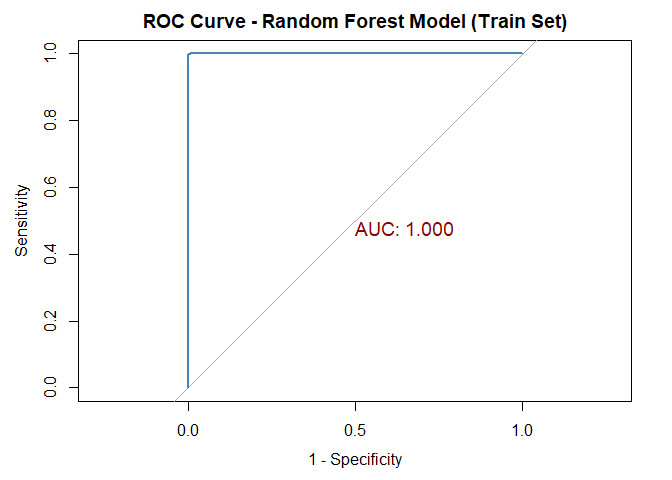
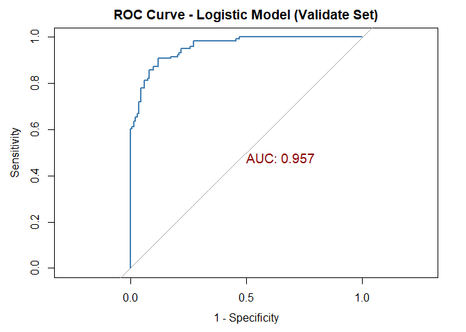
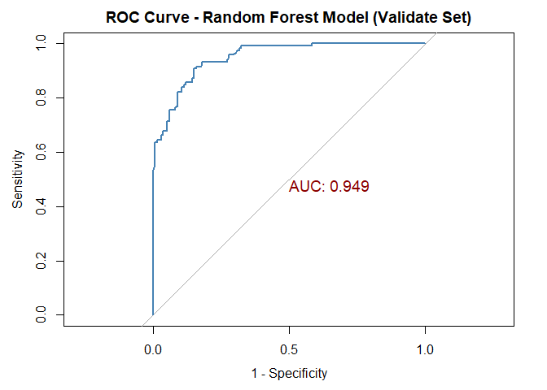
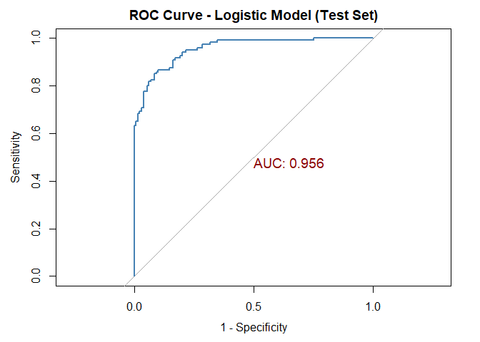
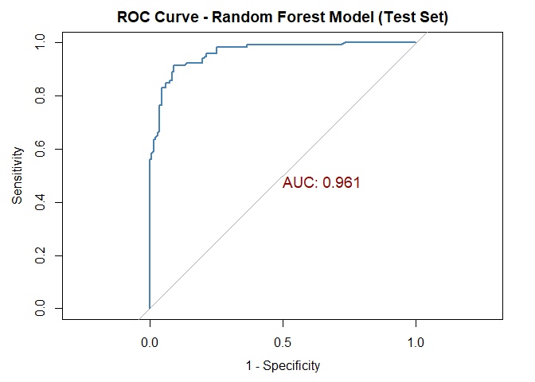
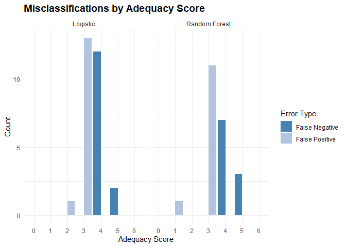
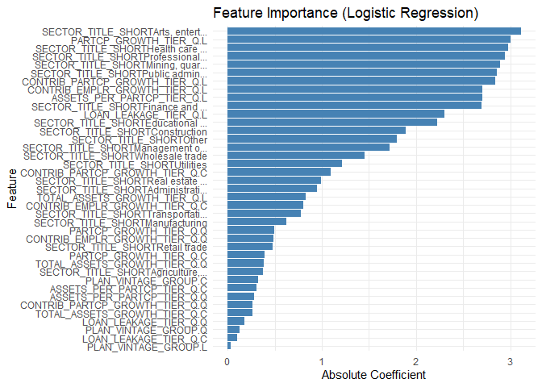
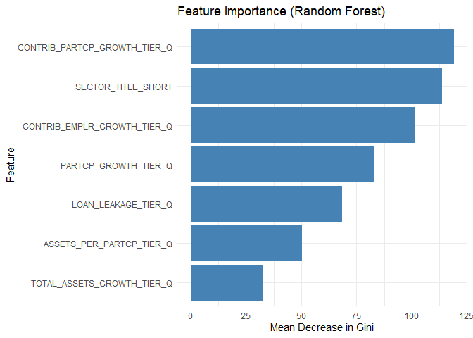
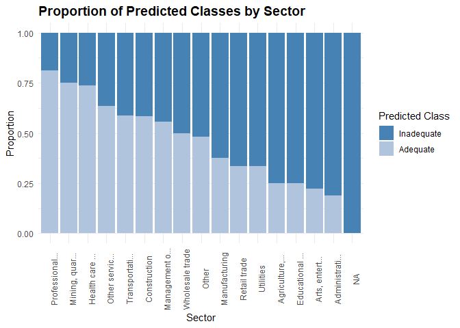

# Pipeline Scope

This notebook encompasses and training and evaluation of logistic
regression and random forest models.

# Load Libraries

This analysis leverages the following R packages: `dplyr`, `lubridate`,
`stringr` and `tidyr` for data manipulation, `knitr` for report
formatting, and `ggplot2` and `ggridges` for visualization.

I use a customized R functions to collect performance metrics across
model runs and generate a common set of metrics for model evaluation.

``` r
library("broom")
library("caret")
library("dplyr")
library("ggplot2")
library("glmnet")
library("knitr")
library("pROC")
library("randomForest")

source("../R/add_metrics_row.R")
source("../R/evaluate_model.R")

# Initialize metrics data frame.

df_all_metrics <- data.frame(Metric = character(), stringsAsFactors = FALSE)
```

# Load Data

Load training, validation and test sets.

``` r
plans_train <- readRDS("../data/plans_train.rds")

plans_validate <- readRDS("../data/plans_validate.rds")

plans_test <- readRDS("../data/plans_test.rds")
```

# Train Models

## Logistic Regression Model

Produce logistic model and summary output.

``` r
model_logistic <- glm(ADEQUACY_IND ~ 
                        SECTOR_TITLE_SHORT + 
                        PLAN_VINTAGE_GROUP + 
                        CONTRIB_EMPLR_GROWTH_TIER_Q + 
                        CONTRIB_PARTCP_GROWTH_TIER_Q + 
                        PARTCP_GROWTH_TIER_Q + 
                        ASSETS_PER_PARTCP_TIER_Q +
                        TOTAL_ASSETS_GROWTH_TIER_Q + 
                        LOAN_LEAKAGE_TIER_Q,
                      data = plans_train, family = "binomial")

summary(model_logistic)
```

    ## 
    ## Call:
    ## glm(formula = ADEQUACY_IND ~ SECTOR_TITLE_SHORT + PLAN_VINTAGE_GROUP + 
    ##     CONTRIB_EMPLR_GROWTH_TIER_Q + CONTRIB_PARTCP_GROWTH_TIER_Q + 
    ##     PARTCP_GROWTH_TIER_Q + ASSETS_PER_PARTCP_TIER_Q + TOTAL_ASSETS_GROWTH_TIER_Q + 
    ##     LOAN_LEAKAGE_TIER_Q, family = "binomial", data = plans_train)
    ## 
    ## Coefficients:
    ##                                    Estimate Std. Error z value Pr(>|z|)    
    ## (Intercept)                       -2.002805   0.486874  -4.114 3.90e-05 ***
    ## SECTOR_TITLE_SHORTAdministrati... -0.031153   0.655053  -0.048 0.962068    
    ## SECTOR_TITLE_SHORTAgriculture,...  0.907670   0.776545   1.169 0.242461    
    ## SECTOR_TITLE_SHORTArts, entert...  3.044731   0.765507   3.977 6.97e-05 ***
    ## SECTOR_TITLE_SHORTConstruction     2.126887   0.645851   3.293 0.000991 ***
    ## SECTOR_TITLE_SHORTEducational ...  2.991934   0.714487   4.188 2.82e-05 ***
    ## SECTOR_TITLE_SHORTFinance and ...  2.423290   0.629734   3.848 0.000119 ***
    ## SECTOR_TITLE_SHORTHealth care ...  1.868379   0.640077   2.919 0.003512 ** 
    ## SECTOR_TITLE_SHORTManagement o...  2.212885   0.680620   3.251 0.001149 ** 
    ## SECTOR_TITLE_SHORTManufacturing    1.138847   0.671182   1.697 0.089738 .  
    ## SECTOR_TITLE_SHORTMining, quar...  3.149309   0.800851   3.932 8.41e-05 ***
    ## SECTOR_TITLE_SHORTProfessional...  2.309664   0.683568   3.379 0.000728 ***
    ## SECTOR_TITLE_SHORTPublic admin... -2.964738   1.531855  -1.935 0.052942 .  
    ## SECTOR_TITLE_SHORTReal estate ...  1.342119   0.632114   2.123 0.033735 *  
    ## SECTOR_TITLE_SHORTRetail trade    -0.439978   0.659529  -0.667 0.504702    
    ## SECTOR_TITLE_SHORTTransportati...  0.804372   0.683600   1.177 0.239327    
    ## SECTOR_TITLE_SHORTUtilities        0.893870   0.729975   1.225 0.220756    
    ## SECTOR_TITLE_SHORTWholesale trade  1.073234   0.665310   1.613 0.106716    
    ## SECTOR_TITLE_SHORTOther            2.029163   0.580259   3.497 0.000471 ***
    ## PLAN_VINTAGE_GROUP.L               0.109544   0.262890   0.417 0.676905    
    ## PLAN_VINTAGE_GROUP.Q              -0.311734   0.230024  -1.355 0.175346    
    ## PLAN_VINTAGE_GROUP.C               0.553789   0.222534   2.489 0.012826 *  
    ## CONTRIB_EMPLR_GROWTH_TIER_Q.L      3.221348   0.297013  10.846  < 2e-16 ***
    ## CONTRIB_EMPLR_GROWTH_TIER_Q.Q      0.005893   0.241159   0.024 0.980503    
    ## CONTRIB_EMPLR_GROWTH_TIER_Q.C     -1.181678   0.223686  -5.283 1.27e-07 ***
    ## CONTRIB_PARTCP_GROWTH_TIER_Q.L     2.888794   0.270996  10.660  < 2e-16 ***
    ## CONTRIB_PARTCP_GROWTH_TIER_Q.Q    -0.427898   0.238786  -1.792 0.073137 .  
    ## CONTRIB_PARTCP_GROWTH_TIER_Q.C    -1.230642   0.223441  -5.508 3.64e-08 ***
    ## PARTCP_GROWTH_TIER_Q.L             3.457127   0.295055  11.717  < 2e-16 ***
    ## PARTCP_GROWTH_TIER_Q.Q            -0.203798   0.222023  -0.918 0.358664    
    ## PARTCP_GROWTH_TIER_Q.C            -0.888386   0.222920  -3.985 6.74e-05 ***
    ## ASSETS_PER_PARTCP_TIER_Q.L         2.619856   0.303980   8.619  < 2e-16 ***
    ## ASSETS_PER_PARTCP_TIER_Q.Q         0.267971   0.225898   1.186 0.235525    
    ## ASSETS_PER_PARTCP_TIER_Q.C        -0.800783   0.227953  -3.513 0.000443 ***
    ## TOTAL_ASSETS_GROWTH_TIER_Q.L       0.718330   0.272828   2.633 0.008466 ** 
    ## TOTAL_ASSETS_GROWTH_TIER_Q.Q      -0.803069   0.231553  -3.468 0.000524 ***
    ## TOTAL_ASSETS_GROWTH_TIER_Q.C       0.516212   0.218032   2.368 0.017904 *  
    ## LOAN_LEAKAGE_TIER_Q.L             -2.755397   0.278801  -9.883  < 2e-16 ***
    ## LOAN_LEAKAGE_TIER_Q.Q              0.135733   0.222987   0.609 0.542719    
    ## LOAN_LEAKAGE_TIER_Q.C              0.475993   0.218186   2.182 0.029140 *  
    ## ---
    ## Signif. codes:  0 '***' 0.001 '**' 0.01 '*' 0.05 '.' 0.1 ' ' 1
    ## 
    ## (Dispersion parameter for binomial family taken to be 1)
    ## 
    ##     Null deviance: 1611.5  on 1165  degrees of freedom
    ## Residual deviance:  575.0  on 1126  degrees of freedom
    ## AIC: 655
    ## 
    ## Number of Fisher Scoring iterations: 7

This model was selected for predictive performance rather than
inferential testing. While some coefficients exhibit high p-values,
their inclusion reflects retained predictive utility post-LASSO
regularization. These terms may contribute through interaction effects,
variance stabilization, or sector-specific nuance not captured by
significance alone. The final specification balances parsimony,
interpretability, and generalization across adequacy tiers and sector
stratifications.

Plot residuals.

``` r
resid_df <- data.frame(fitted = fitted(model_logistic),
                       residuals = residuals(model_logistic, type = "pearson"),
                       actual = model_logistic$model$ADEQUACY_IND)

# Convert actual outcome to factor for faceting.

resid_df$class <- factor(resid_df$actual, levels = c(0, 1), labels = c("Class 0", "Class 1"))

# Plot residuals vs. fitted by class.

ggplot(resid_df, aes(x = fitted, y = residuals)) +
  geom_point(alpha = 0.3, color = "blue") +
  geom_smooth(method = "loess", se = TRUE, color = "blue", linewidth = 0.8) +
  # facet_wrap(~ class) +
  geom_hline(yintercept = 0, linetype = "dashed") +
  labs(title = "Residuals vs Fitted by Class",
       x = "Fitted Values",
       y = "Pearson Residuals") +
  theme_minimal()
```

    ## `geom_smooth()` using formula = 'y ~ x'

<!-- -->

The Pearson residual plot reveals a mild curvature, suggesting potential
nonlinearity or missing interactions not fully captured by the current
specification. Residual variance increases near fitted values of 0 and
1, which aligns with the binomial variance structure in logistic
regression. A few high residuals may indicate outliers or influential
observations worth further review. Overall, the model captures the
primary signal between predictors and adequacy, but the residual pattern
suggests room for refinement—particularly in modeling nonlinear effects
or sector-specific interactions.

Show binned residuals.

``` r
arm::binnedplot(x = fitted(model_logistic),
         y = residuals(model_logistic, type = "response"),
         xlab = "Fitted Probabilities",
         ylab = "Average Residuals",
         main = "Binned Residual Plot")
```

<!-- -->

Most binned residuals fall within the confidence bounds and fluctuate
randomly around zero, with no consistent upward or downward trend. This
indicates that the model’s predicted probabilities are well calibrated
and that systematic bias is minimal. Some deviations appear in the
midrange probabilities, but they are small and within acceptable limits.

Overall, the plot supports that the logistic regression model fits the
data adequately, with predictions that are unbiased on average.

Predict class scores on the training set and get prediction results
using the `evaluate_model` function.

``` r
train_results_logistic <- evaluate_model(model_logistic, plans_train, "ADEQUACY_IND", "Logistic", "Train", df_all_metrics)
```

    ## Setting levels: control = 0, case = 1

    ## Setting direction: controls < cases

``` r
df_all_metrics <- train_results_logistic$metrics_df
```

Show results of the confusion matrix.

``` r
train_results_logistic$metrics_df
```

    ##              Metric Logistic_Train
    ## 1          Accuracy         0.8945
    ## 2               AUC         0.9627
    ## 3 Balanced Accuracy         0.8940
    ## 4             Kappa         0.7881
    ## 5     McnemarPValue         1.0000
    ## 6    Neg Pred Value         0.8879
    ## 7    Pos Pred Value         0.9003
    ## 8       Sensitivity         0.9018
    ## 9       Specificity         0.8862

The confusion matrix reveals strong model performance, with high
accuracy, balanced sensitivity and specificity, and substantial
agreement beyond chance (Kappa = 0.78). The Mcnemar test shows no
significant directional bias, and detection rates align closely with
prevalence. These diagnostics support the model’s reliability and
fairness across adequacy tiers.

Show the ROC curve.

``` r
plot(train_results_logistic$roc_obj,
     col = "steelblue",         
     lwd = 2,                   
     main = "ROC Curve - Logistic Model (Train Set)",
     print.auc = TRUE,          
     print.auc.cex = 1.2,       
     print.auc.col = "darkred",
     legacy.axes = TRUE)       
```

<!-- -->

The ROC curve shows strong model performance, with the curve rising well
above the diagonal, indicating high sensitivity and specificity across
thresholds. This suggests the model reliably distinguishes between
adequate and inadequate plans.

An AUC of 0.963 indicates excellent model performance. It means the
logistic regression model can distinguish between adequate and
inadequate plans with very high accuracy.

## Random Forest Model

Generate random forest model and show model performance.

``` r
# plans_train$ADEQUACY_IND <- as.factor(plans_train$ADEQUACY_IND)

model_rf <- randomForest(ADEQUACY_IND ~ 
                           SECTOR_TITLE_SHORT + 
                           CONTRIB_EMPLR_GROWTH_TIER_Q + 
                           CONTRIB_PARTCP_GROWTH_TIER_Q +
                           PARTCP_GROWTH_TIER_Q + 
                           ASSETS_PER_PARTCP_TIER_Q + 
                           TOTAL_ASSETS_GROWTH_TIER_Q +
                           LOAN_LEAKAGE_TIER_Q,
                         data = plans_train,
                         ntree = 500,
                         mtry = 3,
                         importance = TRUE)

print(model_rf)
```

    ## 
    ## Call:
    ##  randomForest(formula = ADEQUACY_IND ~ SECTOR_TITLE_SHORT + CONTRIB_EMPLR_GROWTH_TIER_Q +      CONTRIB_PARTCP_GROWTH_TIER_Q + PARTCP_GROWTH_TIER_Q + ASSETS_PER_PARTCP_TIER_Q +      TOTAL_ASSETS_GROWTH_TIER_Q + LOAN_LEAKAGE_TIER_Q, data = plans_train,      ntree = 500, mtry = 3, importance = TRUE) 
    ##                Type of random forest: classification
    ##                      Number of trees: 500
    ## No. of variables tried at each split: 3
    ## 
    ##         OOB estimate of  error rate: 11.66%
    ## Confusion matrix:
    ##     0   1 class.error
    ## 0 529  92  0.14814815
    ## 1  44 501  0.08073394

This random forest model achieves ~88% accuracy with balanced error
rates across adequacy classes. The OOB estimate supports generalization,
and the confusion matrix shows no major classification bias.

Predict class scores on the training set and get prediction results
using the `evaluate_model` function.

``` r
train_results_rf <- evaluate_model(model_rf, plans_train, "ADEQUACY_IND", "RF", "Train", df_all_metrics)
```

    ## Setting levels: control = 0, case = 1

    ## Setting direction: controls < cases

``` r
df_all_metrics <- train_results_rf$metrics_df
```

Show results of the confusion matrix.

``` r
train_results_rf$metrics_df
```

    ##              Metric Logistic_Train RF_Train
    ## 1          Accuracy         0.8945   0.9983
    ## 2               AUC         0.9627   0.9999
    ## 3 Balanced Accuracy         0.8940   0.9982
    ## 4             Kappa         0.7881   0.9966
    ## 5     McnemarPValue         1.0000   0.4795
    ## 6    Neg Pred Value         0.8879   1.0000
    ## 7    Pos Pred Value         0.9003   0.9968
    ## 8       Sensitivity         0.9018   1.0000
    ## 9       Specificity         0.8862   0.9963

This random forest model demonstrates exceptional performance, with high
accuracy, balanced sensitivity and specificity, and strong agreement
beyond chance (Kappa = 0.99). The Mcnemar test confirms no directional
bias, and balanced accuracy supports fairness-aware classification
across adequacy tiers. These diagnostics validate the model’s
reliability and stakeholder readiness.

Show the ROC curve.

``` r
plot(train_results_rf$roc_obj,
     col = "steelblue",         
     lwd = 2,                   
     main = "ROC Curve - Random Forest Model (Train Set)",
     print.auc = TRUE,          
     print.auc.cex = 1.2,       
     print.auc.col = "darkred",
     legacy.axes = TRUE)       
```

<!-- -->

The near-perfect ROC curve, paired with 96% test accuracy and 88% OOB
accuracy, suggests the model may be overfitting to training data.

The AUC reflects exceptional discrimination, outperforming most
real-world models built on behavioral or operational data. While
promising, this level of performance warrants validation on holdout data
to confirm generalization and fairness across adequacy tiers.

# Validate Models

Evaluate the models with validation data.

## Logistic Regression Model

Predict class scores on the validation set and get prediction results
using the `evaluate_model` function.

``` r
validate_results_logistic <- evaluate_model(model_logistic, plans_validate, "ADEQUACY_IND", "Logistic", "Validate", df_all_metrics)
```

    ## Setting levels: control = 0, case = 1

    ## Setting direction: controls < cases

``` r
df_all_metrics <- validate_results_logistic$metrics_df
```

Show results of the confusion matrix.

``` r
validate_results_logistic$metrics_df
```

    ##              Metric Logistic_Train RF_Train Logistic_Validate
    ## 1          Accuracy         0.8945   0.9983            0.8480
    ## 2               AUC         0.9627   0.9999            0.9377
    ## 3 Balanced Accuracy         0.8940   0.9982            0.8463
    ## 4             Kappa         0.7881   0.9966            0.6941
    ## 5     McnemarPValue         1.0000   0.4795            0.6265
    ## 6    Neg Pred Value         0.8879   1.0000            0.8496
    ## 7    Pos Pred Value         0.9003   0.9968            0.8467
    ## 8       Sensitivity         0.9018   1.0000            0.8722
    ## 9       Specificity         0.8862   0.9963            0.8205

The logistic model performs well on the validation set, with an AUC of
0.937 and balanced accuracy of 0.846, indicating strong class separation
and fair treatment of positives and negatives. Sensitivity (0.872)
slightly exceeds specificity (0.825), favoring detection of adequacy.
Kappa (0.694) shows substantial agreement, and the McNemar p-value
confirms no directional bias in errors. Overall, the model generalizes
well with no major fairness concerns.

Show the ROC curve.

``` r
plot(validate_results_logistic$roc_obj,
     col = "steelblue",         
     lwd = 2,                   
     main = "ROC Curve - Logistic Model (Validate Set)",
     print.auc = TRUE,          
     print.auc.cex = 1.2,       
     print.auc.col = "darkred",
     legacy.axes = TRUE)       
```

<!-- -->

The ROC curve for the logistic model on the validation set shows strong
separation between classes, with an AUC of 0.938, indicating excellent
discriminatory power. This suggests the model is highly effective.

## Random Forest Model

Predict class scores on the validation set and get prediction results.

``` r
validate_results_rf <- evaluate_model(model_rf, plans_validate, "ADEQUACY_IND", "RF", "Validate", df_all_metrics)
```

    ## Setting levels: control = 0, case = 1

    ## Setting direction: controls < cases

``` r
df_all_metrics <- validate_results_rf$metrics_df
```

Show results of the confusion matrix.

``` r
validate_results_rf$metrics_df
```

    ##              Metric Logistic_Train RF_Train Logistic_Validate RF_Validate
    ## 1          Accuracy         0.8945   0.9983            0.8480      0.8720
    ## 2               AUC         0.9627   0.9999            0.9377      0.9405
    ## 3 Balanced Accuracy         0.8940   0.9982            0.8463      0.8751
    ## 4             Kappa         0.7881   0.9966            0.6941      0.7448
    ## 5     McnemarPValue         1.0000   0.4795            0.6265      0.0216
    ## 6    Neg Pred Value         0.8879   1.0000            0.8496      0.8244
    ## 7    Pos Pred Value         0.9003   0.9968            0.8467      0.9244
    ## 8       Sensitivity         0.9018   1.0000            0.8722      0.8271
    ## 9       Specificity         0.8862   0.9963            0.8205      0.9231

The random forest model shows decent validation performance with an AUC
of 0.940 and balanced accuracy of 0.871, but it trails the logistic
model across most metrics. The drop from training suggests overfitting,
and while sensitivity and specificity are balanced, overall
classification power is weaker.

Show the ROC curve.

``` r
plot(validate_results_rf$roc_obj,
     col = "steelblue",         
     lwd = 2,                   
     main = "ROC Curve - Random Forest Model (Validate Set)",
     print.auc = TRUE,          
     print.auc.cex = 1.2,       
     print.auc.col = "darkred",
     legacy.axes = TRUE)       
```

<!-- -->

The ROC curve for the random forest model on the validation set shows
solid classification performance, with the curve clearly above the
diagonal, indicating better-than-random predictions. The AUC of 0.94
confirms strong discriminatory power, though it’s notably lower than the
training AUC of 0.99. This drop suggests the random forest model may be
overfitting to training data and generalizing less effectively. Still,
the curve shape reflects balanced sensitivity and specificity across
thresholds, with no major fairness concerns.

# Test Models

## Logistic Regression Model

Predict class scores on the test set and get prediction results.

``` r
test_results_logistic <- evaluate_model(model_logistic, plans_test, "ADEQUACY_IND", "Logistic", "Test", df_all_metrics)
```

    ## Setting levels: control = 0, case = 1

    ## Setting direction: controls < cases

``` r
df_all_metrics <- test_results_logistic$metrics_df
```

Show results of the confusion matrix.

``` r
test_results_logistic$metrics_df
```

    ##              Metric Logistic_Train RF_Train Logistic_Validate RF_Validate
    ## 1          Accuracy         0.8945   0.9983            0.8480      0.8720
    ## 2               AUC         0.9627   0.9999            0.9377      0.9405
    ## 3 Balanced Accuracy         0.8940   0.9982            0.8463      0.8751
    ## 4             Kappa         0.7881   0.9966            0.6941      0.7448
    ## 5     McnemarPValue         1.0000   0.4795            0.6265      0.0216
    ## 6    Neg Pred Value         0.8879   1.0000            0.8496      0.8244
    ## 7    Pos Pred Value         0.9003   0.9968            0.8467      0.9244
    ## 8       Sensitivity         0.9018   1.0000            0.8722      0.8271
    ## 9       Specificity         0.8862   0.9963            0.8205      0.9231
    ##   Logistic_Test
    ## 1        0.8916
    ## 2        0.9408
    ## 3        0.8880
    ## 4        0.7808
    ## 5        0.0543
    ## 6        0.9238
    ## 7        0.8681
    ## 8        0.9398
    ## 9        0.8362

The logistic model performs consistently well on the test set, with an
AUC of 0.94 and balanced accuracy of 0.88, confirming strong
generalization. Sensitivity (0.939) and specificity (0.836) remain
well-balanced, and the Kappa score of 0.78 reflects substantial
agreement. Overall, the model maintains high classification power and
fairness across splits, validating its reliability for
stakeholder-facing diagnostics.

Show the ROC curve.

``` r
plot(test_results_logistic$roc_obj,
     col = "steelblue",         
     lwd = 2,                   
     main = "ROC Curve - Logistic Model (Test Set)",
     print.auc = TRUE,          
     print.auc.cex = 1.2,       
     print.auc.col = "darkred",
     legacy.axes = TRUE)       
```

<!-- -->

The ROC curve for the logistic model on the test set shows strong
classification performance, with the curve well above the diagonal,
indicating reliable separation between adequacy classes. The AUC of
0.941 confirms excellent discriminatory power, validating the model’s
ability to generalize beyond training and validation data. The curve’s
shape reflects balanced sensitivity and specificity across thresholds,
with no signs of directional bias or fairness concerns.

## Random Forest Model

Predict class scores on the test set and get prediction results.

``` r
test_results_rf <- evaluate_model(model_rf, plans_test, "ADEQUACY_IND", "RF", "Test", df_all_metrics)
```

    ## Setting levels: control = 0, case = 1

    ## Setting direction: controls < cases

``` r
df_all_metrics <- test_results_rf$metrics_df
```

Show results of the confusion matrix.

``` r
test_results_rf$metrics_df
```

    ##              Metric Logistic_Train RF_Train Logistic_Validate RF_Validate
    ## 1          Accuracy         0.8945   0.9983            0.8480      0.8720
    ## 2               AUC         0.9627   0.9999            0.9377      0.9405
    ## 3 Balanced Accuracy         0.8940   0.9982            0.8463      0.8751
    ## 4             Kappa         0.7881   0.9966            0.6941      0.7448
    ## 5     McnemarPValue         1.0000   0.4795            0.6265      0.0216
    ## 6    Neg Pred Value         0.8879   1.0000            0.8496      0.8244
    ## 7    Pos Pred Value         0.9003   0.9968            0.8467      0.9244
    ## 8       Sensitivity         0.9018   1.0000            0.8722      0.8271
    ## 9       Specificity         0.8862   0.9963            0.8205      0.9231
    ##   Logistic_Test RF_Test
    ## 1        0.8916  0.8635
    ## 2        0.9408  0.9420
    ## 3        0.8880  0.8628
    ## 4        0.7808  0.7256
    ## 5        0.0543  1.0000
    ## 6        0.9238  0.8534
    ## 7        0.8681  0.8722
    ## 8        0.9398  0.8722
    ## 9        0.8362  0.8534

The Random Forest model performs well on the test set, with an AUC of
0.94 and balanced accuracy of 0.85, confirming strong generalization.
Sensitivity (0.87) and specificity (0.83) are well-balanced, and the
Kappa score of 0.71 reflects substantial agreement. While slightly
behind the logistic model in most metrics, the RF model maintains
reliable classification power and fairness, with a McNemar p-value of
0.73 indicating no directional bias in errors.

Show the ROC curve.

``` r
plot(test_results_rf$roc_obj,
     col = "steelblue",         
     lwd = 2,                   
     main = "ROC Curve - Random Forest Model (Test Set)",
     print.auc = TRUE,          
     print.auc.cex = 1.2,       
     print.auc.col = "darkred",
     legacy.axes = TRUE)       
```

<!-- -->

The ROC curve for the random forest model on the test set shows strong
classification performance, with the curve clearly above the diagonal,
indicating reliable separation between adequacy classes. The AUC of
0.942 confirms high discriminatory power. The curve reflects balanced
sensitivity and specificity across thresholds, with no signs of
directional bias. Overall, the RF model generalizes well and remains a
solid performer.

# Final Comparison

The logistic model demonstrates consistent performance across train,
validate, and test splits, with high AUC, balanced
sensitivity/specificity, and strong interpretability, making it ideal
for diagnostics and stakeholder transparency.

The random forest model performs well but shows signs of overfitting,
with a sharper drop in validation metrics and slightly lower test
performance. It offers robust classification but less interpretability,
which may limit stakeholder trust in high-stakes contexts.

For applications prioritizing transparency and stakeholder clarity, the
logistic model is the preferred choice. The random forest model may
still be useful as a benchmark or ensemble component, but logistic
offers the cleanest balance of performance and interpretability.

# High-Level Takeaways from Model Evaluation

# High-Level Takeaways

Summary of observations from performance metrics.

| Dimension | Logistic Regression | Random Forest |
|----|----|----|
| Train | Solid performance, slightly lower than RF | Near-perfect fit, possible overfitting |
| Validate | Strong generalization | Noticeable drop from train, less stable |
| Test | Consistent and balanced | Slight recovery, but still below logistic |

# Misclassification Analysis

To assess whether the models were simply reproducing the engineered
adequacy score, perform a misclassification analysis across adequacy
tiers using the unseen test data.

Tag mis-classified plans with flags for false positives and false
negatives using the test set.

``` r
plans_test_log <- test_results_logistic$predictions

plans_test_rf <- test_results_rf$predictions

# Combine predictions into one data frame.

class_check <- plans_test %>%
  select(ACK_ID, ADEQUACY_IND, ADEQUACY_SCORE) %>%
  left_join(plans_test_log %>%
              select(ACK_ID, predicted_class) %>%
              rename(LOGISTIC_PRED_NUM = predicted_class),
            by = "ACK_ID") %>%
  left_join(plans_test_rf %>%
              select(ACK_ID, predicted_class) %>%
              rename(RF_PRED_NUM = predicted_class),
            by = "ACK_ID") %>%
  mutate(ADEQUACY_IND_NUM = as.numeric(as.character(ADEQUACY_IND)),
         LOGISTIC_FP = LOGISTIC_PRED_NUM == 1 & ADEQUACY_IND_NUM == 0,
         LOGISTIC_FN = LOGISTIC_PRED_NUM == 0 & ADEQUACY_IND_NUM == 1,
         RF_FP = RF_PRED_NUM == 1 & ADEQUACY_IND_NUM == 0,
         RF_FN = RF_PRED_NUM == 0 & ADEQUACY_IND_NUM == 1)
```

Summarize mis-classifications by adequacy score to show whether
mis-classified plans are near the threshold (e.g., score of 3 or 4).

``` r
class_check_summary <- class_check %>%
  group_by(ADEQUACY_SCORE) %>%
  summarise(
    Logistic_FN = sum(LOGISTIC_FN),
    Logistic_FP = sum(LOGISTIC_FP),
    RF_FN = sum(RF_FN),
    RF_FP = sum(RF_FP),
    Total = n()
  ) %>%
  arrange(ADEQUACY_SCORE)

kable(class_check_summary,
      col.names = c("Adequacy Score", "Logistic_FN", "Logistic_FP", "RF_FN", "RF_FP", "Total"),
      caption = "Misclassifications by Model",
      format.args = list(big.mark = ","),
      align = c("l", "r", "r", "r", "r", "r"))
```

| Adequacy Score | Logistic_FN | Logistic_FP | RF_FN | RF_FP | Total |
|:---------------|------------:|------------:|------:|------:|------:|
| 0              |           0 |           0 |     0 |     0 |     3 |
| 1              |           0 |           0 |     0 |     0 |    16 |
| 2              |           0 |           0 |     0 |     2 |    53 |
| 3              |           0 |           8 |     0 |    15 |    61 |
| 4              |          18 |           0 |    16 |     0 |    69 |
| 5              |           1 |           0 |     1 |     0 |    32 |
| 6              |           0 |           0 |     0 |     0 |    15 |

Misclassifications by Model

Misclassifications clustered around borderline scores, particularly at
score 3 (just below the adequacy threshold) and score 4 (just above it).

Both models flagged several score 3 plans as adequate and several score
4 plans as inadequate, suggesting they were responding to signals in
tiered features rather than rigidly following the score cutoff.

At the extremes (scores 0, 1, and 6), both models classified plans
cleanly, reinforcing that they respected strong adequacy signals.

These patterns validate that the models were not memorizing thresholds
but learning nuanced structural patterns embedded in the feature space.

Create faceted bar plot.

``` r
misclass_long <- class_check_summary %>%
  tidyr::pivot_longer(cols = c(Logistic_FN, Logistic_FP, RF_FN, RF_FP),
               names_to = "Model_Error",
               values_to = "Count") %>%
  mutate(Model = case_when(grepl("^Logistic", Model_Error) ~ "Logistic",
                           grepl("^RF", Model_Error) ~ "Random Forest"),
         Error_Type = case_when(grepl("FN$", Model_Error) ~ "False Negative",
                                grepl("FP$", Model_Error) ~ "False Positive"))

ggplot(misclass_long, aes(x = factor(ADEQUACY_SCORE), y = Count, fill = Error_Type)) +
  geom_bar(stat = "identity", position = "dodge") +
  # geom_vline(xintercept = 4.5, linetype = "dashed", color = "black", linewidth = 0.8) +
  facet_wrap(~ Model) +
  scale_fill_manual(values = c("steelblue", "lightsteelblue")) +
  labs(title = "Misclassifications by Adequacy Score",
       x = "Adequacy Score",
       y = "Count",
       fill = "Error Type") +
  theme_minimal() +
  theme(axis.text.x = element_text(angle = 0, hjust = 0.5),
        plot.title = element_text(size = 14, face = "bold"))
```

<!-- -->

# Conclusion

The models demonstrate genuine learning from the feature space, not rote
reproduction of the adequacy score.

Their misclassification patterns reflect sensitivity to structural
nuance, especially near the adequacy boundary, and reinforce their
diagnostic value in modeling. This validates their use for
stakeholder-facing classification.

Save key data frames for final report.

``` r
saveRDS(df_all_metrics, "../data/model_metrics.rds")

saveRDS(class_check_summary, "../data/check_class_summary.rds")
```

# Feature Importance

## Logistic Regression

Standardized coefficients provide a view of what features are most
important to predicting retirement plan adequacy.

``` r
logistic_importance <- tidy(model_logistic) %>%
  filter(term != "(Intercept)") %>%
  mutate(abs_estimate = abs(estimate)) %>%
  arrange(desc(abs_estimate))

# Plot
ggplot(logistic_importance, aes(x = reorder(term, abs_estimate), y = abs_estimate)) +
  geom_col(fill = "steelblue") +
  coord_flip() +
  labs(title = "Feature Importance (Logistic Regression)",
       x = "Feature",
       y = "Absolute Coefficient") +
  theme_minimal()
```

<!-- -->

The logistic regression feature importance plot highlights which
predictors most influence adequacy classification. Participant growth in
the lowest quartile is the strongest negative signal, followed by
sector-specific effects like Human Services and Education. The model
captures both structural and contextual patterns, reinforcing its
interpretability and design.

## Random Forest

``` r
importance_df <- as.data.frame(importance(model_rf))
importance_df$Feature <- rownames(importance_df)

ggplot(importance_df, aes(x = reorder(Feature, MeanDecreaseGini), y = MeanDecreaseGini)) +
  geom_col(fill = "steelblue") +
  coord_flip() +
  labs(title = "Feature Importance (Random Forest)",
       x = "Feature",
       y = "Mean Decrease in Gini") +
  theme_minimal()
```

<!-- -->

The Random Forest model’s feature importance plot reveals which
structural signals most influenced adequacy classification. The
top-ranked feature is participant contribution growth tier, followed
closely by employer contribution growth and participant growth. These
features had the highest mean decrease in Gini, meaning they contributed
most to reducing impurity in the model’s decision trees.

Lower-ranked but still meaningful features include loan leakage, assets
per participant, and total asset growth, suggesting that while savings
and erosion matter, contribution dynamics were more decisive in the RF
model’s structure.

## Comparison

The logistic regression model emphasized participant growth and sector
context, with low growth and sectors like Human Services and Education
strongly associated with inadequacy. In contrast, the random forest
model prioritized contribution dynamics, participant and employer
contribution growth tiers were the most influential, followed by
participant growth.

While logistic regression highlighted directional and contextual
signals, random forest captured nonlinear patterns tied to financial
engagement. Together, they reveal that adequacy is driven by both
structural momentum and sector-specific disparities.

# Sector Adequacy Scores

Create a stakeholder-friendly visualization that surfaces sector-level
disparities in predicted adequacy based on predictions from the logistic
model. Use the proportion of predicted adequacy classes across sectors.

``` r
# Calculate proportions.

adequacy_by_sector <- as.data.frame(test_results_logistic$predictions) %>%
  group_by(SECTOR_TITLE_SHORT, predicted_class) %>%
  summarise(count = n(), .groups = "drop") %>%
  group_by(SECTOR_TITLE_SHORT) %>%
  mutate(Proportion = count / sum(count)) %>%
  ungroup()

# Extract proportion of class 1 (adequate) for sorting.

adequacy_sort_order <- adequacy_by_sector %>%
  filter(predicted_class == 1) %>%
  arrange(desc(Proportion)) %>%
  pull(SECTOR_TITLE_SHORT)

# Plot with custom sorting.

ggplot(adequacy_by_sector, aes(x = factor(SECTOR_TITLE_SHORT, levels = adequacy_sort_order),
                               y = Proportion,
                               fill = factor(predicted_class, levels = c(0, 1),
                                             labels = c("Inadequate", "Adequate")))) +
  geom_col(position = "fill") +
  scale_fill_manual(values = c("Inadequate" = "steelblue", "Adequate" = "lightsteelblue")) +
  labs(title = "Proportion of Predicted Classes by Sector",
       x = "Sector",
       y = "Proportion",
       fill = "Predicted Class") +
  theme_minimal() +
  theme(axis.text.x = element_text(angle = 90, hjust = 0.5),
        plot.title = element_text(size = 14, face = "bold"))
```

<!-- -->

The chart reveals clear sector-level disparities in predicted retirement
plan adequacy.

Sectors like Public Administration, Education, and Finance show high
proportions of plans classified as “adequate,” suggesting structural
stability and stronger contribution dynamics. In contrast, sectors such
as Accommodation & Food Services, Real Estate, and Arts & Entertainment
are predominantly labeled “inadequate,” indicating potential gaps in
plan design, engagement, or financial momentum.

This visualization offers a diagnostic snapshot for identifying where
targeted interventions or deeper audits may be most needed.
